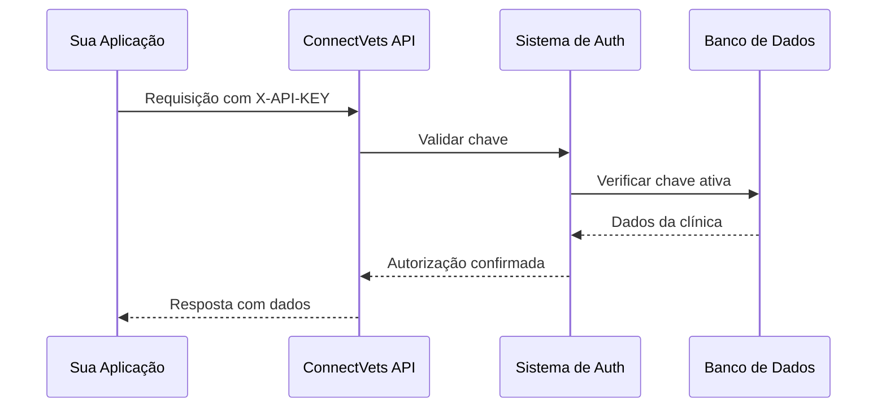

## O que são API Keys?

As **API Keys** (Chaves de API) são tokens únicos que identificam e autenticam sua aplicação ou clínica ao usar a API ConnectVets Notes. Funcionam como uma "senha" que comprova que você tem permissão para acessar e usar nossos serviços.

<Info>
  Cada API Key é **única** e identifica um **Tenant/Clínica** específico dentro da plataforma.
</Info>

## Como Funcionam

### Anatomia de uma API Key

As API Keys do ConnectVets seguem um formato específico para facilitar identificação:

<CodeGroup>
```text Estrutura Visual
┌─────┬──────┬────────────────────────────────────────┐
│ cvn │ live │ abc123def456ghi789jkl012mno345pqr678   │
└─────┴──────┴────────────────────────────────────────┘
  │     │       │
  │     │       └── Token único (32 caracteres)
  │     └────────── Ambiente (live/test)  
  └──────────────── Prefixo ConnectVets Notes
```

```text Exemplo Real
cvn_live_abc123def456ghi789jkl012mno345pqr678
```
</CodeGroup>

<CardGroup cols={3}>
  <Card
    title="Prefixo"
    icon="tag"
  >
    **cvn**
    
    Identifica que é uma chave do ConnectVets Notes
  </Card>
  
  <Card
    title="Ambiente"
    icon="server"
  >
    **live** ou **test**
    
    Indica se é produção ou desenvolvimento
  </Card>
  
  <Card
    title="Token"
    icon="key"
  >
    **32 caracteres**
    
    Identificador único criptografado
  </Card>
</CardGroup>

### Fluxo de Autenticação



## Tipos de API Keys

### Por Ambiente

<CardGroup cols={2}>
  <Card
    title="Produção (Live)"
    icon="globe"
  >
    **Prefixo**: `cvn_live_`
    
    - Usada em produção
    - Dados reais de clínicas
    - Rate limits padrão
    - Monitoramento ativo
  </Card>
  
  <Card
    title="Teste (Test)"
    icon="flask"
  >
    **Prefixo**: `cvn_test_`
    
    - Ambiente de desenvolvimento
    - Dados fictícios
    - Rate limits relaxados
    - Ideal para testes
  </Card>
</CardGroup>

### Por Permissões

| Tipo | Descrição | Permissões |
|------|-----------|------------|
| **Admin** | Acesso completo | Criar, ler, atualizar, deletar tudo |
| **Write** | Leitura e escrita | Criar e ler notas, gerenciar webhooks |
| **Read** | Apenas leitura | Listar e visualizar notas existentes |

## Gerenciamento de API Keys

### Criação

1. **Acesse o painel**: `https://notes.connectvets.com.br`
2. **Vá para Configurações** → **API Keys**
3. **Clique em "Nova API Key"**
4. **Escolha o tipo** e **nomeie** a chave
5. **Copie a chave** (exibida apenas uma vez!)

<Warning>
  **Importante**: A chave é exibida **apenas uma vez** após a criação. Se perder, será necessário criar uma nova.
</Warning>

### Exemplo de Criação

```bash
# Exemplo de resposta ao criar uma API Key
{
  "id": "key_123456789",
  "name": "Integração DoctorVet",
  "key_prefix": "cvn_live_abc123",
  "type": "write",
  "rate_limit_per_minute": 100,
  "rate_limit_per_hour": 1000,
  "is_active": true,
  "created_at": "2024-02-14T18:25:43Z"
}
```

### Rotação de Chaves

<AccordionGroup>
  <Accordion title="Quando fazer rotação?">
    - **Periodicidade**: A cada 6-12 meses
    - **Comprometimento**: Se suspeitar que foi exposta
    - **Mudança de equipe**: Quando desenvolvedores saem
    - **Auditoria**: Como boa prática de segurança
  </Accordion>
  
  <Accordion title="Como fazer rotação?">
    1. **Crie uma nova** API Key
    2. **Atualize seus sistemas** com a nova chave
    3. **Teste o funcionamento** em staging
    4. **Deploy em produção**
    5. **Revogue a chave antiga** após confirmação
  </Accordion>
  
  <Accordion title="Rotação sem downtime">
    ```bash
    # 1. Criar nova chave
    # 2. Implementar fallback
    const API_KEYS = [
      process.env.NEW_API_KEY,    // Nova chave (prioritária)
      process.env.OLD_API_KEY     // Chave antiga (backup)
    ];
    
    // 3. Após validação, remover chave antiga
    ```
  </Accordion>
</AccordionGroup>

## Segurança

### ✅ Boas Práticas

- **Nunca compartilhe** em código público (GitHub, Slack, etc.)
- **Use variáveis de ambiente** para armazenar
- **Implemente fallback** durante rotação
- **Monitore uso** regularmente
- **Revogue imediatamente** se comprometida

### ❌ Práticas Perigosas

- Hardcoded no código
- Enviada por email ou chat
- Compartilhada em screenshots
- Commitada no Git
- Logada em arquivos de debug

### Exemplo de Armazenamento Seguro

```bash
# .env (NUNCA commitar este arquivo)
CONNECTVETS_API_KEY=cvn_live_abc123def456...
CONNECTVETS_ENVIRONMENT=production

# .env.example (pode commitar)
CONNECTVETS_API_KEY=your_api_key_here
CONNECTVETS_ENVIRONMENT=development
```

```javascript
// Uso correto em código
const apiKey = process.env.CONNECTVETS_API_KEY;

if (!apiKey) {
  throw new Error('API Key não configurada');
}

const response = await fetch('/api/notes', {
  headers: {
    'X-API-KEY': apiKey
  }
});
```

## Rate Limiting

As API Keys têm limites de uso para garantir estabilidade:

### Limites Padrão

| Tipo de Chave | Requisições/Minuto | Requisições/Hora | Upload/Minuto |
|---------------|-------------------|-----------------|---------------|
| **Admin** | 200 | 2.000 | 10 arquivos |
| **Write** | 100 | 1.000 | 10 arquivos |
| **Read** | 150 | 1.500 | - |

### Headers de Rate Limit

```http
HTTP/1.1 200 OK
X-RateLimit-Limit-Minute: 100
X-RateLimit-Remaining-Minute: 87
X-RateLimit-Reset-Minute: 1642694400
X-RateLimit-Limit-Hour: 1000
X-RateLimit-Remaining-Hour: 892
```

### Tratamento de Rate Limit

```javascript
async function makeAPIRequest(url, options) {
  const response = await fetch(url, options);
  
  if (response.status === 429) {
    const resetTime = response.headers.get('X-RateLimit-Reset-Minute');
    const waitTime = (resetTime * 1000) - Date.now();
    
    console.log(`Rate limit atingido. Aguardando ${waitTime}ms`);
    await new Promise(resolve => setTimeout(resolve, waitTime));
    
    // Tentar novamente
    return makeAPIRequest(url, options);
  }
  
  return response;
}
```

## Monitoramento

### Métricas Importantes

<CardGroup cols={2}>
  <Card
    title="Uso da API"
    icon="chart-line"
  >
    - Requisições por hora/dia
    - Rate limits atingidos
    - Padrões de uso
    - Picos de tráfego
  </Card>
  
  <Card
    title="Segurança"
    icon="shield"
  >
    - Tentativas de acesso negado
    - IPs suspeitos
    - Padrões anômalos
    - Última utilização
  </Card>
</CardGroup>

### Dashboard de Monitoramento

```javascript
// Exemplo de métricas no painel
{
  "api_key_id": "key_123456789",
  "last_used_at": "2024-02-14T18:25:43Z",
  "total_requests_today": 1247,
  "rate_limit_hits": 3,
  "unique_ips": 2,
  "most_used_endpoints": [
    "/notes",
    "/notes/{id}",
    "/webhooks"
  ]
}
```

## Múltiplas Clínicas

### Estratégias de Gerenciamento

<AccordionGroup>
  <Accordion title="Uma API Key por Clínica">
    **Recomendado** para a maioria dos casos
    
    ```javascript
    const clinicAPIKeys = {
      'clinica_centro': 'cvn_live_abc123...',
      'clinica_zona_sul': 'cvn_live_def456...',
      'clinica_matriz': 'cvn_live_ghi789...'
    };
    
    function getAPIKey(clinicId) {
      return clinicAPIKeys[clinicId];
    }
    ```
  </Accordion>
  
  <Accordion title="API Key Master + Tenant Header">
    Para grandes volumes com muitas clínicas
    
    ```javascript
    // Usando header adicional (futuro)
    const response = await fetch('/api/notes', {
      headers: {
        'X-API-KEY': masterApiKey,
        'X-Tenant-ID': clinicId
      }
    });
    ```
  </Accordion>
</AccordionGroup>

### Mapeamento de Clínicas

```javascript
// Configuração centralizada
const clinicsConfig = {
  'clinica_001': {
    name: 'Clínica Centro Veterinário',
    apiKey: process.env.CLINIC_001_API_KEY,
    webhookUrl: 'https://clinic001.com/webhook',
    settings: { autoNotify: true }
  },
  'clinica_002': {
    name: 'PetCare Zona Sul', 
    apiKey: process.env.CLINIC_002_API_KEY,
    webhookUrl: 'https://petcare.com/notifications',
    settings: { autoNotify: false }
  }
};
```

## Troubleshooting

### Erros Comuns

<AccordionGroup>
  <Accordion title="401 - Unauthorized">
    **Causas possíveis:**
    - API Key inválida ou inexistente
    - Chave desativada
    - Header mal formatado
    
    **Soluções:**
    ```javascript
    // Verificar header
    headers: {
      'X-API-KEY': 'cvn_live_abc123...' // Sem espaços extras
    }
    
    // Verificar se chave está ativa no painel
    ```
  </Accordion>
  
  <Accordion title="403 - Forbidden">
    **Causas possíveis:**
    - Chave sem permissão para a operação
    - Tentativa de acesso a dados de outra clínica
    
    **Soluções:**
    - Verificar tipo da chave (read/write/admin)
    - Confirmar que está acessando dados corretos
  </Accordion>
  
  <Accordion title="429 - Rate Limit">
    **Causas possíveis:**
    - Muitas requisições em pouco tempo
    - Uploads em massa
    
    **Soluções:**
    - Implementar backoff exponencial
    - Distribuir requisições ao longo do tempo
    - Considerar upgrade do plano
  </Accordion>
</AccordionGroup>

## Migração e Backup

### Backup de Configurações

```bash
# Script para backup de configurações
#!/bin/bash

echo "Backup das API Keys ativas..."

curl -H "X-API-KEY: $ADMIN_KEY" \
  https://api.connectvets.com/admin/api-keys \
  | jq '.[] | {id, name, type, created_at}' \
  > api_keys_backup_$(date +%Y%m%d).json

echo "Backup concluído!"
```

### Auditoria

```javascript
// Relatório de uso das API Keys
async function generateAPIKeyReport() {
  const keys = await getActiveAPIKeys();
  
  const report = await Promise.all(
    keys.map(async (key) => {
      const stats = await getKeyStats(key.id);
      return {
        name: key.name,
        type: key.type,
        lastUsed: stats.last_used_at,
        requestsToday: stats.requests_today,
        status: stats.last_used_at > oneWeekAgo ? 'active' : 'inactive'
      };
    })
  );
  
  return report;
}
```

## Próximos Passos

<CardGroup cols={2}>
  <Card
    title="Autenticação"
    icon="key"
    href="/authentication"
  >
    Guia prático de como usar API Keys
  </Card>
  <Card
    title="Início Rápido"
    icon="rocket"
    href="/quickstart"
  >
    Configure sua primeira API Key
  </Card>
  <Card
    title="Gerenciar Chaves"
    icon="settings"
    href="/api-reference/api-keys/list"
  >
    Endpoints para gerenciar API Keys
  </Card>
  <Card
    title="Conceitos - Tenants"
    icon="building"
    href="/concepts/tenants"
  >
    Entenda o sistema multi-clínica
  </Card>
</CardGroup> 