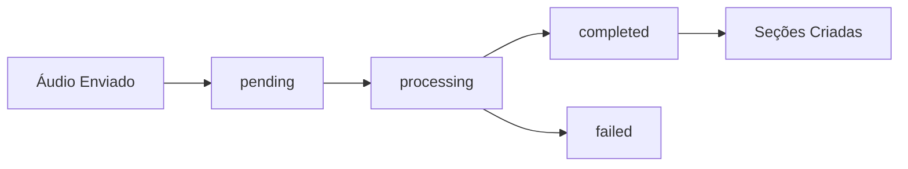

## O que são Notas?

As **Notas** são o elemento central da plataforma ConnectVets Notes. Elas representam transcrições estruturadas de consultas veterinárias, convertendo áudio em texto organizado e pesquisável.

## Ciclo de Vida de uma Nota



### Estados da Transcrição

<CardGroup cols={2}>
  <Card title="pending" icon="clock">
    **Aguardando processamento**
    - Áudio foi recebido e validado
    - Aguardando na fila de processamento
  </Card>
  
  <Card title="processing" icon="gear">
    **Em processamento**
    - IA está transcrevendo o áudio
    - Pode levar alguns minutos
  </Card>
  
  <Card title="completed" icon="check">
    **Concluído**
    - Transcrição finalizada com sucesso
    - Seções estruturadas disponíveis
  </Card>
  
  <Card title="failed" icon="x">
    **Falhou**
    - Erro no processamento
    - Verifique qualidade do áudio
  </Card>
</CardGroup>

## Estrutura de uma Nota

### Dados Básicos

```json
{
  "id": "6a4fe1de-52c4-4b2b-a30f-4b3fa9d7d8b3",
  "name": "Rex",
  "gender": "male",
  "external_id": "CLIENTE_123",
  "transcription_status": "completed",
  "created_at": "2024-02-14T18:25:43Z"
}
```

| Campo | Tipo | Descrição |
|-------|------|-----------|
| `id` | UUID | Identificador único da nota |
| `name` | String | Nome do paciente |
| `gender` | Enum | Sexo: `male`, `female`, `unidentified` |
| `external_id` | String | ID do seu sistema (opcional) |
| `transcription_status` | Enum | Status do processamento |

### Arquivos de Áudio

```json
{
  "audio_name": "rex_consulta_20240214.wav",
  "audio_url": "https://cdn.connectvets.com.br/audio/6a4fe1de.wav"
}
```

- **audio_name**: Nome original do arquivo
- **audio_url**: URL para download do áudio

### Transcrição

```json
{
  "transcription_url": "https://cdn.connectvets.com.br/transcripts/6a4fe1de.txt"
}
```

<Info>
  A `transcription_url` só fica disponível quando o status é `completed`
</Info>

### Metadados Personalizados

```json
{
  "metadata": [
    {"key": "procedimento", "value": "vacina"},
    {"key": "peso", "value": "12.5kg"},
    {"key": "idade", "value": "3 anos"}
  ]
}
```

Use metadados para armazenar informações adicionais específicas do seu sistema.

## Seções de Nota

Quando uma nota é processada com sucesso, ela é automaticamente dividida em **seções estruturadas**:

### Seções Padrão

<CardGroup cols={2}>
  <Card title="Anamnese" icon="clipboard-list">
    **Histórico do paciente**
    - Sintomas relatados
    - Histórico médico
    - Comportamento
  </Card>
  
  <Card title="Exame Físico" icon="stethoscope">
    **Avaliação física**
    - Peso, temperatura
    - Sinais vitais
    - Observações físicas
  </Card>
  
  <Card title="Diagnóstico" icon="diagnoses">
    **Conclusões médicas**
    - Diagnóstico principal
    - Diagnósticos diferenciais
  </Card>
  
  <Card title="Tratamento" icon="pills">
    **Plano terapêutico**
    - Medicações prescritas
    - Dosagens
    - Instruções
  </Card>
</CardGroup>

### Estrutura das Seções

```json
{
  "note_sections": [
    {
      "id": "9b7d8b6a-12e3-45fa-9c1c-7e12f5c4a1b2",
      "title": "Anamnese",
      "label": "anamnesis",
      "content": "Paciente apresenta histórico de...",
      "order": "1"
    }
  ]
}
```

| Campo | Descrição |
|-------|-----------|
| `title` | Nome exibido da seção |
| `label` | Identificador interno da seção |
| `content` | Conteúdo transcrito |
| `order` | Ordem de exibição |

## Requisitos de Áudio

### Formato Recomendado

<Warning>
  Para melhores resultados, use **WAV, 16kHz, mono, 16-bit**
</Warning>

**Especificações técnicas:**
- **Formato**: WAV (recomendado) ou FLAC
- **Taxa de amostragem**: 16.000 Hz
- **Canais**: Mono (1 canal)
- **Bit depth**: 16-bit
- **Codificação**: PCM linear

### Formatos Aceitos

| Formato | Suporte | Observações |
|---------|---------|-------------|
| WAV | ✅ Ideal | Melhor qualidade |
| FLAC | ✅ Bom | Compressão sem perda |
| MP3 | ⚠️ Aceito | Qualidade reduzida |
| M4A | ⚠️ Aceito | Qualidade reduzida |

### Qualidade do Áudio

**Dicas para melhor transcrição:**

- **Ambiente silencioso**: Minimize ruído de fundo
- **Distância adequada**: 30-50cm do microfone
- **Fala clara**: Evite falar muito rápido
- **Volume consistente**: Não muito baixo ou alto

## Filtros e Busca

### Filtros Disponíveis

Use estes parâmetros para filtrar notas:

```http
GET /notes?transcription_status=completed&name=rex&from=2024-01-01
```

| Parâmetro | Tipo | Exemplo | Descrição |
|-----------|------|---------|-----------|
| `external_id` | String | `CLIENTE_123` | ID do seu sistema |
| `transcription_status` | Enum | `completed` | Status da transcrição |
| `valid` | Boolean | `true` | Notas válidas/inválidas |
| `name` | String | `rex` | Nome do paciente (busca parcial) |
| `from` | Date | `2024-01-01` | Data inicial |
| `to` | Date | `2024-01-31` | Data final |

### Busca Textual

Para buscar no conteúdo das seções, use a API de busca:

```http
GET /notes/search?q=vacina&section=treatment
```

## Webhooks para Notas

Configure webhooks para receber notificações automáticas:

### Eventos Disponíveis

- `note.created`: Nova nota criada
- `note.processing`: Processamento iniciado
- `note.completed`: Transcrição concluída
- `note.failed`: Processamento falhou

### Payload do Webhook

```json
{
  "event": "note.completed",
  "data": {
    "id": "6a4fe1de-52c4-4b2b-a30f-4b3fa9d7d8b3",
    "name": "Rex",
    "transcription_status": "completed",
    "external_id": "CLIENTE_123"
  },
  "timestamp": "2024-02-14T18:30:23Z"
}
```

## Casos de Uso Comuns

### 1. Integração com Sistema Veterinário

```javascript
// Enviar áudio após consulta
async function processConsultation(patientId, audioFile) {
  const formData = new FormData();
  formData.append('audio', audioFile);
  formData.append('name', patient.name);
  formData.append('external_id', patientId);
  
  const response = await fetch('/notes', {
    method: 'POST',
    headers: { 'X-API-KEY': apiKey },
    body: formData
  });
  
  return response.json();
}
```

### 2. Buscar Notas por Período

```javascript
// Relatório mensal
async function getMonthlyReport(year, month) {
  const from = `${year}-${month.toString().padStart(2, '0')}-01`;
  const to = `${year}-${month.toString().padStart(2, '0')}-31`;
  
  const response = await fetch(
    `/notes?from=${from}&to=${to}&transcription_status=completed&per_page=100`,
    { headers: { 'X-API-KEY': apiKey } }
  );
  
  return response.json();
}
```

### 3. Sincronizar com Sistema Local

```javascript
// Verificar notas processadas
async function syncProcessedNotes() {
  const pendingNotes = await getLocalPendingNotes();
  
  for (const note of pendingNotes) {
    const response = await fetch(`/notes/${note.id}`, {
      headers: { 'X-API-KEY': apiKey }
    });
    
    const updated = await response.json();
    
    if (updated.transcription_status === 'completed') {
      await updateLocalNote(note.id, updated);
    }
  }
}
```

## Melhores Práticas

### 📁 Organização

- Use `external_id` para vincular ao seu sistema
- Padronize nomenclatura de pacientes
- Configure metadados úteis para filtros

### ⚡ Performance

- Monitore o status via webhooks
- Use paginação para listas grandes  
- Cache resultados quando possível

### 🔒 Segurança

- Nunca exponha URLs de áudio publicamente
- Use HTTPS sempre
- Rotacione API keys periodicamente

### 📊 Monitoramento

- Acompanhe taxa de sucesso das transcrições
- Monitore tempo de processamento
- Configure alertas para falhas

## Próximos Passos

<CardGroup cols={2}>
  <Card
    title="Criar sua primeira nota"
    icon="plus"
    href="/api-reference/notes/create"
  >
    Veja como enviar áudio para transcrição
  </Card>
  <Card
    title="Configurar webhooks"
    icon="webhook"
    href="/concepts/webhooks"
  >
    Receba notificações automáticas
  </Card>
  <Card
    title="Filtros avançados"
    icon="filter"
    href="/examples/advanced-filtering"
  >
    Aprenda a buscar notas específicas
  </Card>
  <Card
    title="Tenants/Clínicas"
    icon="building"
    href="/concepts/tenants"
  >
    Entenda o sistema multi-clínica
  </Card>
</CardGroup> 