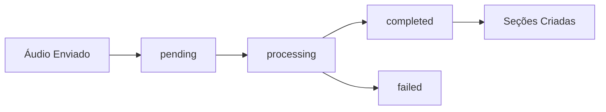

## O que são Notas?

As **Notas** são o elemento central da plataforma ConnectVets Notes. Elas representam transcrições estruturadas de consultas veterinárias, convertendo áudio em texto organizado e pesquisável.

## Ciclo de Vida de uma Nota



### Estados da Transcrição

<CardGroup cols={2}>
  <Card title="pending" icon="clock">
    **Aguardando processamento**
    - Áudio foi recebido e validado
    - Aguardando na fila de processamento
  </Card>
  
  <Card title="processing" icon="gear">
    **Em processamento**
    - IA está transcrevendo o áudio
    - Pode levar alguns minutos
  </Card>
  
  <Card title="completed" icon="check">
    **Concluído**
    - Transcrição finalizada com sucesso
    - Seções estruturadas disponíveis
  </Card>
  
  <Card title="failed" icon="x">
    **Falhou**
    - Erro no processamento
    - Verifique qualidade do áudio
  </Card>
</CardGroup>

## Estrutura de uma Nota

### Dados Básicos

```json
{
  "id": "6a4fe1de-52c4-4b2b-a30f-4b3fa9d7d8b3",
  "name": "Rex",
  "gender": "male",
  "external_id": "CLIENTE_123",
  "transcription_status": "completed",
  "created_at": "2024-02-14T18:25:43Z"
}
```

| Campo | Tipo | Descrição |
|-------|------|-----------|
| `id` | UUID | Identificador único da nota |
| `name` | String | Nome do paciente |
| `gender` | Enum | Sexo: `male`, `female`, `unidentified` |
| `external_id` | String | ID do seu sistema (opcional) |
| `transcription_status` | Enum | Status do processamento |

### Arquivos de Áudio

```json
{
  "audio_name": "rex_consulta_20240214.wav",
  "audio_url": "https://cdn.connectvets.com.br/audio/6a4fe1de.wav"
}
```

- **audio_name**: Nome original do arquivo
- **audio_url**: URL para download do áudio

### Transcrição

```json
{
  "transcription_url": "https://cdn.connectvets.com.br/transcripts/6a4fe1de.txt"
}
```

<Info>
  A `transcription_url` só fica disponível quando o status é `completed`
</Info>

### Metadados Personalizados

```json
{
  "metadata": [
    {"key": "procedimento", "value": "vacina"},
    {"key": "peso", "value": "12.5kg"},
    {"key": "idade", "value": "3 anos"}
  ]
}
```

Use metadados para armazenar informações adicionais específicas do seu sistema.

## Seções de Nota

Quando uma nota é processada com sucesso, ela é automaticamente dividida em **seções estruturadas**:

### Seções Padrão

<CardGroup cols={2}>
  <Card title="Anamnese" icon="clipboard-list">
    **Histórico do paciente**
    - Sintomas relatados
    - Histórico médico
    - Comportamento
  </Card>
  
  <Card title="Exame Físico" icon="stethoscope">
    **Avaliação física**
    - Peso, temperatura
    - Sinais vitais
    - Observações físicas
  </Card>
  
  <Card title="Diagnóstico" icon="diagnoses">
    **Conclusões médicas**
    - Diagnóstico principal
    - Diagnósticos diferenciais
  </Card>
  
  <Card title="Tratamento" icon="pills">
    **Plano terapêutico**
    - Medicações prescritas
    - Dosagens
    - Instruções
  </Card>
</CardGroup>

### Estrutura das Seções

```json
{
  "note_sections": [
    {
      "id": "9b7d8b6a-12e3-45fa-9c1c-7e12f5c4a1b2",
      "title": "Anamnese",
      "label": "anamnesis",
      "content": "Paciente apresenta histórico de...",
      "order": "1"
    }
  ]
}
```

| Campo | Descrição |
|-------|-----------|
| `title` | Nome exibido da seção |
| `label` | Identificador interno da seção |
| `content` | Conteúdo transcrito |
| `order` | Ordem de exibição |

## Requisitos de Áudio

### Formato Recomendado

<Warning>
  Para melhores resultados, use **WAV, 16kHz, mono, 16-bit**
</Warning>

**Especificações técnicas:**
- **Formato**: WAV (recomendado) ou FLAC
- **Taxa de amostragem**: 16.000 Hz
- **Canais**: Mono (1 canal)
- **Bit depth**: 16-bit
- **Codificação**: PCM linear

### Formatos Aceitos

| Formato | Suporte | Observações |
|---------|---------|-------------|
| WAV | ✅ Ideal | Melhor qualidade |
| FLAC | ✅ Bom | Compressão sem perda |
| MP3 | ⚠️ Aceito | Qualidade reduzida |
| M4A | ⚠️ Aceito | Qualidade reduzida |

### Qualidade do Áudio

**Dicas para melhor transcrição:**

- **Ambiente silencioso**: Minimize ruído de fundo
- **Distância adequada**: 30-50cm do microfone
- **Fala clara**: Evite falar muito rápido
- **Volume consistente**: Não muito baixo ou alto

## Limites e Restrições

### Tamanho do Arquivo

| Plano | Tamanho Máximo | Duração Máxima |
|-------|---------------|----------------|
| **Gratuito** | 25 MB | 30 minutos |
| **Pro** | 100 MB | 120 minutos |
| **Enterprise** | 500 MB | 480 minutos |

### Tempo de Processamento

**Estimativas típicas:**
- Arquivos de até 10 minutos: 2-5 minutos
- Arquivos de 10-30 minutos: 5-15 minutos
- Arquivos de 30-60 minutos: 15-30 minutos

<Info>
  Tempos podem variar baseado na carga do sistema e qualidade do áudio
</Info>

## Exemplos de Uso

### Criando uma Nota

<CodeGroup>
```bash cURL
curl -X POST "https://api.connectvets.com.br/v1/notes" \
  -H "X-API-KEY: your_api_key" \
  -F "audio=@consulta.wav" \
  -F "name=Rex" \
  -F "gender=male" \
  -F "external_id=PET_001"
```

```javascript JavaScript
const formData = new FormData();
formData.append('audio', audioFile);
formData.append('name', 'Rex');
formData.append('gender', 'male');
formData.append('external_id', 'PET_001');

const response = await fetch('https://api.connectvets.com.br/v1/notes', {
  method: 'POST',
  headers: {
    'X-API-KEY': 'your_api_key'
  },
  body: formData
});
```

```python Python
import requests

files = {'audio': open('consulta.wav', 'rb')}
data = {
    'name': 'Rex',
    'gender': 'male',
    'external_id': 'PET_001'
}

response = requests.post(
    'https://api.connectvets.com.br/v1/notes',
    headers={'X-API-KEY': 'your_api_key'},
    files=files,
    data=data
)
```
</CodeGroup>

### Consultando Status

<CodeGroup>
```bash cURL
curl -X GET "https://api.connectvets.com.br/v1/notes/6a4fe1de-52c4-4b2b-a30f-4b3fa9d7d8b3" \
  -H "X-API-KEY: your_api_key"
```

```javascript JavaScript
const noteId = "6a4fe1de-52c4-4b2b-a30f-4b3fa9d7d8b3";

const response = await fetch(`https://api.connectvets.com.br/v1/notes/${noteId}`, {
  headers: {
    'X-API-KEY': 'your_api_key'
  }
});

const note = await response.json();
console.log('Status:', note.data.transcription_status);
```

```python Python
note_id = "6a4fe1de-52c4-4b2b-a30f-4b3fa9d7d8b3"

response = requests.get(
    f'https://api.connectvets.com.br/v1/notes/{note_id}',
    headers={'X-API-KEY': 'your_api_key'}
)

note = response.json()
print(f"Status: {note['data']['transcription_status']}")
```
</CodeGroup>

### Listando Notas

<CodeGroup>
```bash cURL
curl -X GET "https://api.connectvets.com.br/v1/notes?transcription_status=completed&limit=10" \
  -H "X-API-KEY: your_api_key"
```

```javascript JavaScript
const params = new URLSearchParams({
  transcription_status: 'completed',
  limit: '10',
  page: '1'
});

const response = await fetch(`https://api.connectvets.com.br/v1/notes?${params}`, {
  headers: {
    'X-API-KEY': 'your_api_key'
  }
});

const notes = await response.json();
console.log('Notas:', notes.data);
```

```python Python
params = {
    'transcription_status': 'completed',
    'limit': 10,
    'page': 1
}

response = requests.get(
    'https://api.connectvets.com.br/v1/notes',
    headers={'X-API-KEY': 'your_api_key'},
    params=params
)

notes = response.json()
print(f"Total: {notes['meta']['total']}")
```
</CodeGroup>

## Próximos Passos

<CardGroup cols={2}>
  <Card title="Webhooks" icon="webhook" href="/concepts/webhooks">
    Receba notificações quando notas forem processadas
  </Card>
  <Card title="Tenants" icon="building" href="/concepts/tenants">
    Organize notas por clínica com workspaces
  </Card>
  <Card title="API Keys" icon="key" href="/concepts/api-keys">
    Configure autenticação e permissões
  </Card>
  <Card title="Exemplos" icon="code" href="/examples/basic-integration">
    Veja integrações práticas
  </Card>
</CardGroup>

---

<Tip>
**Dúvidas sobre notas?** Consulte nossa [API Reference](/api-reference/notes/create) ou entre em contato no [Discord](https://discord.gg/uN4NxUGk).
</Tip> 