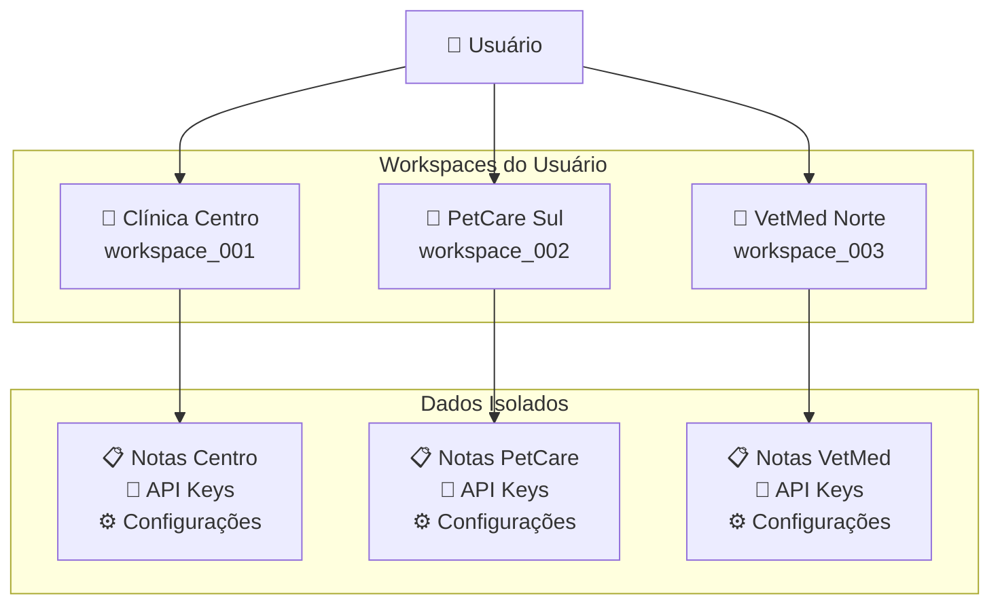
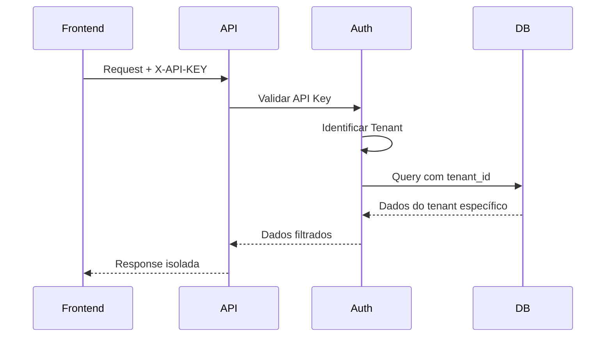
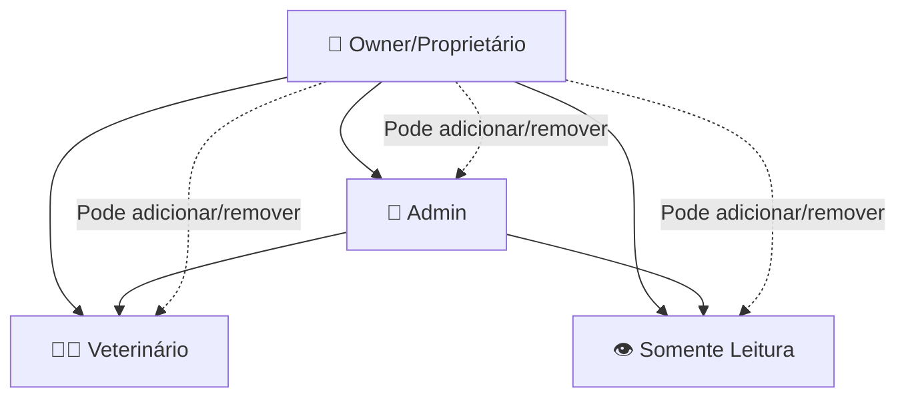
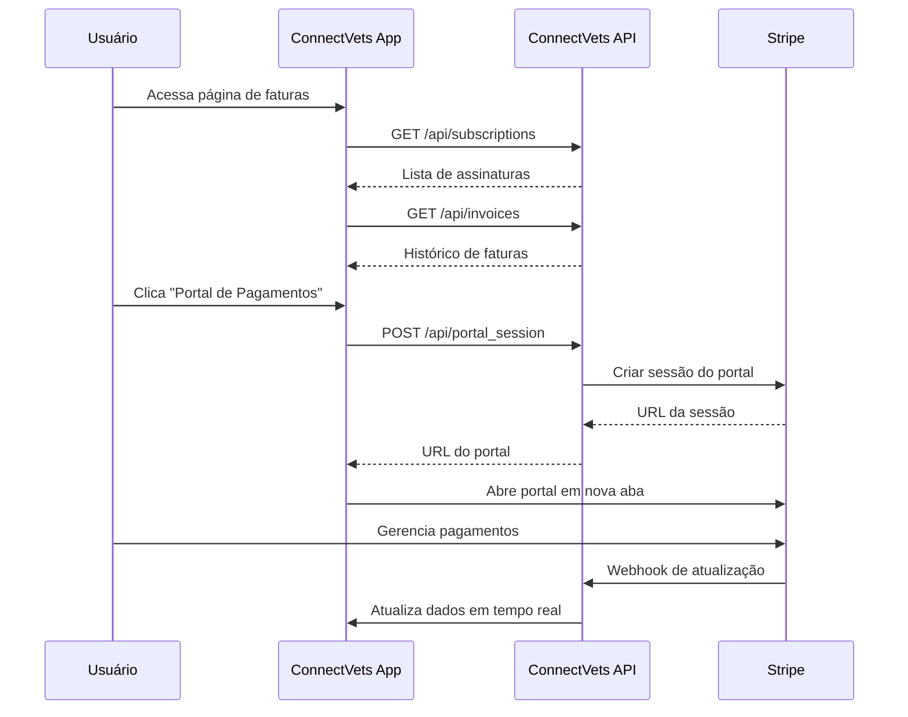

## O que são Tenants/Workspaces?

**Tenants** (chamados de **Workspaces** no frontend) são espaços isolados onde cada clínica veterinária gerencia suas consultas, notas e configurações de forma independente. É o núcleo do sistema multi-tenant do ConnectVets Notes.

<Info>
  **Backend** = "Tenant" | **Frontend** = "Workspace"
  
  Ambos se referem ao mesmo conceito: um espaço isolado para uma clínica veterinária.
</Info>

## Como Funcionam

### Arquitetura Multi-Tenant



### Isolamento de Dados

Cada workspace mantém **dados completamente isolados**:

| Recurso | Escopo | Exemplo |
|---------|--------|---------|
| **Notas** | Por workspace | Consultas da Clínica Centro ≠ PetCare |
| **API Keys** | Por workspace | Chave única para cada clínica |
| **Configurações** | Por workspace | Webhooks, integrações próprias |
| **Usuários** | Por workspace | Veterinários específicos da clínica |
| **Agentes IA** | Por workspace | Treinamentos personalizados |

## Criação de Workspaces

### Interface de Criação

Com base no componente `WorkspaceModal.tsx`:

```javascript
// Estrutura do modal de criação
{
  name: "Nome da Clínica",        // Máximo 32 caracteres
  maxLength: 32,                  // Limite de caracteres
  validation: "required"          // Nome obrigatório
}
```

### Processo de Criação

<Steps>
  <Step title="Abrir Modal">
    Usuário clica em "Novo Workspace" no painel
  </Step>
  <Step title="Preencher Nome">
    Digite o nome da clínica (máx. 32 caracteres)
  </Step>
  <Step title="Validação">
    Sistema verifica permissões e plano ativo
  </Step>
  <Step title="Criação">
    Novo workspace é criado e selecionado automaticamente
  </Step>
</Steps>

### Exemplo de Criação via API

```javascript
// Frontend: WorkspaceModal.tsx
const handleSubmit = async (e) => {
  e.preventDefault();
  setLoading(true);
  
  try {
    await createTenant(name);  // createTenant do AuthContext
    setName('');
    onOpenChange(false);
  } catch (err) {
    // Tratamento de erros
    if (err.code === 'forbidden') {
      setError('Você não tem permissão para criar workspaces, contrate um plano pago!');
    }
  }
};
```

### Restrições por Plano

<CardGroup cols={2}>
  <Card
    title="Plano Gratuito"
    icon="free"
  >
    - **1 workspace** incluído
    - Funcionalidades básicas
    - Limite de notas mensais
    - Sem criação adicional
  </Card>
  
  <Card
    title="Planos Pagos"
    icon="credit-card"
  >
    - **Múltiplos workspaces**
    - Sem limite de criação
    - Funcionalidades avançadas
    - Suporte prioritário
  </Card>
</CardGroup>

## Seleção e Troca de Workspaces

### Contexto de Autenticação

```javascript
// AuthContext - gerenciamento de tenants
const {
  currentTenant,      // Workspace atualmente selecionado
  tenants,           // Lista de todos os workspaces do usuário
  selectTenant,      // Função para trocar workspace
  createTenant       // Função para criar novo workspace
} = useAuth();
```

### Troca de Workspace

```javascript
// Exemplo de troca
const handleWorkspaceChange = (newWorkspaceId) => {
  const selectedWorkspace = tenants.find(t => t.id === newWorkspaceId);
  selectTenant(selectedWorkspace);
  
  // Automaticamente:
  // - Recarrega dados do novo workspace
  // - Atualiza API calls com novo tenant
  // - Redireciona para dashboard do workspace
};
```

### Dropdown de Seleção

```javascript
// TenantDropdown.tsx (exemplo conceitual)
<Select onValueChange={handleWorkspaceChange}>
  {tenants.map(tenant => (
    <SelectItem key={tenant.id} value={tenant.id}>
      🏥 {tenant.name}
      {tenant.id === currentTenant.id && " (Atual)"}
    </SelectItem>
  ))}
</Select>
```

## Exclusão de Workspaces

### Processo de Exclusão

Com base no componente `DeleteWorkspaceDialog.tsx`:

<Warning>
  **Ação Irreversível**: A exclusão remove **TODOS** os dados do workspace, incluindo notas, configurações e agentes IA.
</Warning>

### Confirmação por Nome

```javascript
// Proteção contra exclusão acidental
const confirmationRequired = currentTenant?.name;
const userInput = confirmInput;

// Botão só habilita quando:
const canDelete = userInput === confirmationRequired;
```

### Fluxo de Exclusão

<Steps>
  <Step title="Confirmação">
    Usuário deve digitar o **nome exato** do workspace
  </Step>
  <Step title="Validação">
    Sistema confirma que o nome confere
  </Step>
  <Step title="Exclusão">
    Remove todos os dados do workspace
  </Step>
  <Step title="Redirecionamento">
    Seleciona outro workspace disponível ou redireciona
  </Step>
</Steps>

### Exemplo de Implementação

```javascript
// DeleteWorkspaceDialog.tsx
const handleDelete = async () => {
  setLoading(true);
  
  try {
    // API call para deletar o tenant
    await fetch('/api/tenant', { 
      method: 'DELETE', 
      credentials: 'include' 
    });
    
    // Redireciona para outro workspace se disponível
    if (currentTenant && tenants?.length) {
      const remaining = tenants.filter(t => t.id !== currentTenant.id);
      if (remaining.length) {
        selectTenant(remaining[0]);
      }
    }
  } catch (error) {
    console.error('Erro ao deletar workspace:', error);
  }
  
  setLoading(false);
  onOpenChange(false);
};
```

## Integração com API

### Headers de Tenant

Cada requisição à API identifica o workspace ativo:

```javascript
// Exemplo de requisição
const response = await fetch('/api/notes', {
  headers: {
    'X-API-KEY': workspaceApiKey,           // API Key específica do workspace
    'Authorization': `Bearer ${userToken}`, // Token do usuário
    'Content-Type': 'application/json'
  }
});
```

### Isolamento na API



## Casos de Uso Comuns

### 1. Veterinário com Múltiplas Clínicas

```javascript
// Configuração para veterinário que atende em 3 clínicas
const veterinarioWorkspaces = [
  {
    id: "ws_001",
    name: "Clínica Centro Veterinário", 
    role: "admin",
    api_key: "cvn_live_abc123..."
  },
  {
    id: "ws_002", 
    name: "PetCare Zona Sul",
    role: "veterinarian",
    api_key: "cvn_live_def456..."
  },
  {
    id: "ws_003",
    name: "Hospital Veterinário Norte",
    role: "consultant", 
    api_key: "cvn_live_ghi789..."
  }
];
```

### 2. Franquia com Múltiplas Unidades

```javascript
// Gerenciamento de franquia
const franquiaConfig = {
  matriz: {
    name: "VetGroup Matriz",
    settings: {
      canCreateUnits: true,
      centralizedBilling: true,
      sharedTemplates: true
    }
  },
  unidades: [
    { name: "VetGroup Shopping", inheritsFrom: "matriz" },
    { name: "VetGroup Centro", inheritsFrom: "matriz" },
    { name: "VetGroup Barra", inheritsFrom: "matriz" }
  ]
};
```

### 3. Rede de Clínicas

```javascript
// Configuração para rede
const redeClinicas = {
  admin: {
    canAccess: "all_workspaces",
    permissions: ["read", "write", "admin"],
    dashboardView: "consolidated"
  },
  managers: {
    canAccess: "assigned_workspaces", 
    permissions: ["read", "write"],
    dashboardView: "individual"
  },
  veterinarians: {
    canAccess: "single_workspace",
    permissions: ["read"],
    dashboardView: "notes_only"
  }
};
```

## Migração e Backup

### Transferência entre Workspaces

<AccordionGroup>
  <Accordion title="Mover Notas">
    ```javascript
    // API para transferir notas entre workspaces
    POST /api/notes/transfer
    {
      "source_tenant_id": "ws_001",
      "target_tenant_id": "ws_002", 
      "note_ids": ["note_123", "note_456"],
      "preserve_metadata": true
    }
    ```
  </Accordion>
  
  <Accordion title="Duplicar Configurações">
    ```javascript
    // Copiar configurações de um workspace para outro
    POST /api/tenant/duplicate-settings
    {
      "source_tenant_id": "ws_001",
      "target_tenant_id": "ws_002",
      "include": ["webhooks", "api_keys", "templates"]
    }
    ```
  </Accordion>
  
  <Accordion title="Backup Completo">
    ```bash
    # Script para backup de workspace
    curl -H "X-API-KEY: $API_KEY" \
      "https://api.connectvets.com/export/workspace" \
      > backup_workspace_$(date +%Y%m%d).json
    ```
  </Accordion>
</AccordionGroup>

## Monitoramento e Analytics

### Métricas por Workspace

```javascript
// Dashboard de métricas
const workspaceMetrics = {
  notes: {
    total: 1247,
    thisMonth: 89,
    avgPerDay: 12.3,
    status: {
      completed: 1180,
      processing: 45, 
      failed: 22
    }
  },
  apiUsage: {
    requestsToday: 342,
    rateLimit: "87% used",
    mostUsedEndpoint: "/notes"
  },
  storage: {
    audioFiles: "2.4 GB",
    textData: "124 MB", 
    totalUsed: "2.5 GB",
    planLimit: "10 GB"
  }
};
```

### Relatórios Consolidados

```javascript
// Para usuários com múltiplos workspaces
const consolidatedReport = {
  totalWorkspaces: 3,
  totalNotes: 3891,
  totalAPIUsage: 15247,
  topWorkspace: {
    name: "Clínica Centro",
    notes: 1891,
    growth: "+23% this month"
  },
  alerts: [
    {
      workspace: "PetCare Sul",
      type: "approaching_limit",
      message: "85% do limite de notas atingido"
    }
  ]
};
```

## Segurança e Permissões

### Controle de Acesso

| Nível | Permissões | Exemplo |
|-------|------------|---------|
| **Owner** | Tudo + delete workspace | Dono da clínica |
| **Admin** | Gerenciar usuários + configs | Gerente da clínica |
| **Veterinarian** | Criar/editar notas | Veterinário ativo |
| **Read Only** | Visualizar apenas | Estagiário |

### Auditoria

```javascript
// Log de ações por workspace
const auditLog = {
  workspace_id: "ws_001",
  actions: [
    {
      timestamp: "2024-02-14T10:30:00Z",
      user: "dr.silva@clinica.com",
      action: "note_created",
      resource_id: "note_789",
      ip: "192.168.1.100"
    },
    {
      timestamp: "2024-02-14T09:15:00Z", 
      user: "admin@clinica.com",
      action: "user_invited",
      resource_id: "user_456",
      ip: "192.168.1.101"
    }
  ]
};
```

## Troubleshooting

### Problemas Comuns

<AccordionGroup>
  <Accordion title="Erro: Workspace não encontrado">
    **Causa**: Workspace foi deletado ou usuário perdeu acesso
    
    **Solução**:
    ```javascript
    // Verificar workspaces disponíveis
    const availableWorkspaces = await fetchUserWorkspaces();
    if (availableWorkspaces.length === 0) {
      // Redirecionar para criação de workspace
      redirectTo('/workspace/create');
    }
    ```
  </Accordion>
  
  <Accordion title="Dados não aparecem após troca">
    **Causa**: Cache não atualizado ou API key incorreta
    
    **Solução**:
    ```javascript
    // Forçar reload dos dados
    const switchWorkspace = async (newWorkspace) => {
      await selectTenant(newWorkspace);
      await clearCache();
      await reloadData();
    };
    ```
  </Accordion>
  
  <Accordion title="Não consegue criar workspace">
    **Causa**: Limitação do plano ou permissões
    
    **Solução**:
    - Verificar plano ativo
    - Contatar suporte para upgrade
    - Verificar se atingiu limite do plano
  </Accordion>
</AccordionGroup>

## Usuários Secundários

### Sistema Multi-Usuário por Workspace

Cada workspace pode ter **múltiplos usuários** trabalhando colaborativamente, dependendo do plano contratado. O sistema permite adicionar **usuários secundários** que compartilham acesso aos dados do workspace.

<Info>
  **Usuários Secundários** são contas adicionais que podem acessar um workspace específico, cada uma com suas próprias credenciais e permissões.
</Info>

### Hierarquia de Usuários



### Limitações por Plano

Com base no componente `UsersManager.tsx`:

<CardGroup cols={3}>
  <Card
    title="Plano Individual"
    icon="user"
  >
    - **1 usuário** apenas
    - Funcionalidades básicas
    - Sem usuários secundários
    - Ideal para veterinários autônomos
  </Card>
  
  <Card
    title="Planos Clínicas"
    icon="users"
  >
    - **Múltiplos usuários**
    - Limite baseado no plano
    - Colaboração em equipe
    - Gerenciamento avançado
  </Card>
  
  <Card
    title="Enterprise Customizado"
    icon="building"
  >
    - **Usuários ilimitados***
    - Configuração personalizada
    - Suporte dedicado
    - Integração avançada
  </Card>
</CardGroup>

### Interface de Gerenciamento

```javascript
// Baseado em UsersManager.tsx
const {
  user,           // Usuário atual logado
  currentTenant   // Workspace ativo
} = useAuth();

// Verificar se é proprietário do workspace
const isOwner = user && currentTenant && user.email === currentTenant.email;

// Dados do plano atual
const subscription = currentTenant.subscription;
const plan = subscription.plan;
const maxUsers = plan.max_users;        // Limite de usuários
const isTrial = plan.type === 'trial';  // Se é trial
```

### Adição de Usuários Secundários

<Steps>
  <Step title="Verificar Plano">
    Sistema verifica se o plano permite usuários adicionais
  </Step>
  <Step title="Validar Limite">
    Confirma se não atingiu o limite do plano atual
  </Step>
  <Step title="Convidar por Email">
    Owner adiciona email do novo usuário
  </Step>
  <Step title="Validação">
    Sistema verifica se o email existe na plataforma
  </Step>
  <Step title="Acesso Concedido">
    Usuário ganha acesso ao workspace
  </Step>
</Steps>

### Exemplo de Implementação

```javascript
// Processo de adicionar usuário secundário
const handleAddUser = async (email) => {
  // Verificar se atingiu limite do plano
  if (maxUsers !== null && users.length >= maxUsers) {
    toast.error('Limite de usuários atingido pelo seu plano');
    return;
  }
  
  // Verificar se é plano trial
  if (isTrial) {
    toast.error('Esta função só está disponível para planos pagos');
    return;
  }
  
  try {
    const res = await fetch('/api/tenant', {
      method: 'PUT',
      headers: { 'Content-Type': 'application/json' },
      credentials: 'include',
      body: JSON.stringify({ email })
    });
    
    if (!res.ok) {
      const data = await res.json();
      if (data.code === 'forbidden') {
        throw new Error('Este usuário não existe, por favor adicione um usuário válido!');
      }
      throw new Error(data.message || 'Erro ao adicionar usuário');
    }
    
    toast.success(`Usuário ${email} adicionado com sucesso!`);
    loadUsers(); // Recarregar lista
    
  } catch (error) {
    toast.error(error.message);
  }
};
```

### Informações dos Usuários

Cada usuário secundário possui:

```typescript
interface TenantUser {
  id: string;                    // ID único do usuário
  name?: string;                 // Nome completo (opcional)
  email: string;                 // Email (obrigatório)
  regulatory_doc?: string;       // CRMV ou documento regulatório
  created_at: string;           // Data de criação
  role?: 'admin' | 'vet' | 'readonly'; // Papel no workspace
}
```

### Exemplo de Lista de Usuários

```javascript
// Interface mostra informações dos usuários
const UserCard = ({ user, isOwner, onDelete }) => (
  <Card className="relative">
    <CardHeader>
      <CardTitle>{user.name || 'Nome não informado'}</CardTitle>
    </CardHeader>
    <CardContent>
      <p>Email: {user.email}</p>
      {user.regulatory_doc && (
        <p>Registro: {user.regulatory_doc}</p>
      )}
      <p>Desde: {format(new Date(user.created_at), "dd 'de' MMMM yyyy")}</p>
    </CardContent>
    
    {/* Botão de exclusão apenas para owners */}
    {isOwner && (
      <Button 
        variant="ghost" 
        className="absolute top-2 right-2 text-red-500"
        onClick={() => onDelete(user.id, user.email)}
      >
        <Trash2 className="w-4 h-4" />
      </Button>
    )}
  </Card>
);
```

### Remoção de Usuários

Apenas o **proprietário** pode remover usuários secundários:

```javascript
const handleDeleteUser = async (userId, email) => {
  try {
    const res = await fetch('/api/tenant/user', {
      method: 'DELETE',
      headers: { 'Content-Type': 'application/json' },
      credentials: 'include',
      body: JSON.stringify({ user_id: userId })
    });
    
    if (!res.ok) {
      throw new Error('Erro ao remover usuário');
    }
    
    toast.success('Usuário removido com sucesso');
    loadUsers(); // Atualizar lista
    
  } catch (error) {
    toast.error(error.message);
  }
};
```

### Controle de Acesso

<AccordionGroup>
  <Accordion title="Proprietário (Owner)">
    **Permissões completas:**
    - Adicionar/remover usuários secundários
    - Gerenciar configurações do workspace
    - Deletar workspace
    - Todas as funcionalidades da plataforma
    
    **Identificação:**
    ```javascript
    const isOwner = user.email === currentTenant.email;
    ```
  </Accordion>
  
  <Accordion title="Usuário Secundário">
    **Permissões limitadas:**
    - Acessar dados do workspace
    - Criar/editar notas (se permitido)
    - Ver relatórios
    - **NÃO pode** adicionar outros usuários
    - **NÃO pode** deletar workspace
    
    **Controle:**
    ```javascript
    // Botões específicos só aparecem para owners
    {isOwner && (
      <Button onClick={addUser}>Novo Usuário Secundário</Button>
    )}
    ```
  </Accordion>
</AccordionGroup>

### Upgrade de Planos

Para workspaces que atingiram o limite:

```javascript
// Interface de upgrade quando limite atingido
{maxUsers === 1 && (
  <div className="text-blue-600 space-y-1">
    <p>Você está no <strong>Plano Individual</strong>. 
       Deseja adicionar mais usuários à equipe?</p>
    <Link href="/notes/planos/clinicas" 
          className="bg-blue-600 text-white px-4 py-2 rounded-md">
      Conheça nossos planos para Clínicas
    </Link>
  </div>
)}
```

### Contadores de Limite

```javascript
// Exibir uso atual vs limite do plano
const remaining = maxUsers !== null ? maxUsers - users.length : null;

// Interface mostra progresso
<p className="text-sm text-muted-foreground">
  {users.length} de {maxUsers} usuários utilizados
  {remaining === 0 ? ' (limite atingido)' : ''}
</p>
```

### Validações e Restrições

<CardGroup cols={2}>
  <Card
    title="Plano Trial"
    icon="clock"
  >
    - **Não permite** usuários secundários
    - Mensagem: "Esta função só está disponível para planos pagos"
    - Upgrade necessário
  </Card>
  
  <Card
    title="Limite Atingido"
    icon="ban"
  >
    - Botão "Novo Usuário" **desabilitado**
    - Mensagem: "Limite de usuários atingido pelo seu plano"
    - Sugestão de upgrade
  </Card>
</CardGroup>

### API Endpoints para Usuários

```bash
# Listar usuários do workspace
GET /api/tenant/users
Authorization: Bearer {token}

# Adicionar usuário secundário
PUT /api/tenant
Content-Type: application/json
{
  "email": "novo@usuario.com"
}

# Remover usuário secundário  
DELETE /api/tenant/user
Content-Type: application/json
{
  "user_id": "user_12345"
}
```

### Casos de Uso para Usuários Secundários

<AccordionGroup>
  <Accordion title="Clínica com Equipe">
    ```javascript
    // Exemplo: Clínica veterinária com múltiplos profissionais
    const clinicTeam = [
      {
        email: "dr.silva@clinica.com",
        role: "owner",
        name: "Dr. João Silva",
        regulatory_doc: "CRMV-SP 12345"
      },
      {
        email: "dra.santos@clinica.com", 
        role: "veterinarian",
        name: "Dra. Maria Santos",
        regulatory_doc: "CRMV-SP 67890"
      },
      {
        email: "recepcao@clinica.com",
        role: "readonly", 
        name: "Ana Recepção",
        regulatory_doc: null
      }
    ];
    ```
  </Accordion>
  
  <Accordion title="Franquia Multi-Unidade">
    ```javascript
    // Franquia com gerentes por unidade
    const franchiseStructure = {
      owner: "admin@vetgroup.com",
      units: [
        {
          name: "VetGroup Shopping",
          manager: "manager.shopping@vetgroup.com",
          staff: ["vet1@vetgroup.com", "vet2@vetgroup.com"]
        },
        {
          name: "VetGroup Centro", 
          manager: "manager.centro@vetgroup.com",
          staff: ["vet3@vetgroup.com", "vet4@vetgroup.com"]
        }
      ]
    };
    ```
  </Accordion>
  
  <Accordion title="Hospital Veterinário">
    ```javascript
    // Hospital com diferentes especialidades
    const hospitalTeam = {
      administration: ["admin@hospital.com"],
      veterinarians: [
        "cirurgia@hospital.com",
        "cardiologia@hospital.com", 
        "oncologia@hospital.com"
      ],
      residents: [
        "residente1@hospital.com",
        "residente2@hospital.com"
      ],
      support: ["recepcao@hospital.com"]
    };
    ```
  </Accordion>
</AccordionGroup>

## Sistema de Cobrança e Faturas

### Gestão Financeira por Workspace

Cada workspace possui seu próprio **sistema de cobrança independente**, com assinaturas, faturas e histórico de pagamentos específicos. O sistema integra com o **Stripe** para processamento seguro de pagamentos.

<Info>
  **Cobrança Isolada**: Cada workspace tem sua própria assinatura e faturas, permitindo gestão financeira independente para cada clínica.
</Info>

### Estrutura de Assinaturas

Com base no componente de faturas:

```typescript
interface Subscription {
  id: string;                        // ID único da assinatura
  plan_id: string;                   // ID do plano contratado
  status: string;                    // Status atual (active, canceled, trial, etc.)
  current_period_start: string;      // Início do período atual
  current_period_end: string;        // Fim do período (próxima cobrança)
  cancel_at_period_end: boolean;     // Se será cancelada no fim do período
  stripe_subscription_id?: string;   // ID no Stripe
  plan: {
    id: string;
    name: string;                    // Nome do plano
    price: number;                   // Preço em centavos
    currency: string;                // Moeda (BRL)
    billing_cycle: string;           // Ciclo: 'monthly' ou 'yearly'
  };
}
```

### Status de Assinaturas

<CardGroup cols={2}>
  <Card
    title="Assinaturas Ativas"
    icon="check-circle"
  >
    **Status disponíveis:**
    - `active`: ✅ Ativo e funcionando
    - `trial`: ⏰ Período de teste
    - `past_due`: ⚠️ Pagamento em atraso
    - `incomplete`: ❌ Configuração incompleta
  </Card>
  
  <Card
    title="Assinaturas Inativas"
    icon="x-circle"
  >
    **Status de cancelamento:**
    - `canceled`: ❌ Cancelada permanentemente
    - `cancel_at_period_end`: 📅 Cancelará no fim do período
    - `unpaid`: 💳 Não paga (suspensa)
  </Card>
</CardGroup>

### Interface de Assinaturas

```javascript
// Carregar assinaturas do workspace atual
const loadSubscriptions = async () => {
  const response = await fetch('/api/subscriptions', {
    credentials: 'include',
    cache: 'no-store'
  });
  
  if (response.ok) {
    const subscriptions = await response.json();
    setSubscriptions(subscriptions);
  }
};

// Exibir informações da assinatura
const SubscriptionCard = ({ subscription }) => (
  <Card>
    <CardHeader>
      <CardTitle>{subscription.plan.name}</CardTitle>
      {getStatusBadge(subscription.status)}
    </CardHeader>
    <CardContent>
      <div className="grid grid-cols-3 gap-4">
        {/* Preço */}
        <div className="flex items-center gap-2">
          <DollarSign className="w-4 h-4" />
          <div>
            <p className="font-medium">
              {formatPrice(subscription.plan.price)}
            </p>
            <p className="text-xs text-muted-foreground">
              por {subscription.plan.billing_cycle === 'monthly' ? 'mês' : 'ano'}
            </p>
          </div>
        </div>
        
        {/* Próxima cobrança */}
        <div className="flex items-center gap-2">
          <Calendar className="w-4 h-4" />
          <div>
            <p className="text-sm font-medium">Próxima cobrança</p>
            <p className="text-xs text-muted-foreground">
              {formatDate(subscription.current_period_end)}
            </p>
          </div>
        </div>
        
        {/* Cancelamento agendado */}
        {subscription.cancel_at_period_end && (
          <div className="flex items-center gap-2">
            <XCircle className="w-4 h-4 text-destructive" />
            <div>
              <p className="text-sm font-medium text-destructive">
                Será cancelada
              </p>
              <p className="text-xs text-muted-foreground">
                em {formatDate(subscription.current_period_end)}
              </p>
            </div>
          </div>
        )}
      </div>
    </CardContent>
  </Card>
);
```

### Sistema de Faturas

```typescript
interface Invoice {
  id: string;                    // ID único da fatura
  amount: number;               // Valor em centavos
  currency: string;             // Moeda (BRL)
  status: string;               // Status do pagamento
  paid_at?: string;             // Data do pagamento (se pago)
  due_date: string;             // Data de vencimento
  description?: string;         // Descrição da cobrança
  stripe_invoice_id?: string;   // ID no Stripe
}
```

### Status de Faturas

| Status | Descrição | Ícone | Cor |
|--------|-----------|-------|-----|
| `paid` | ✅ Pago com sucesso | CheckCircle | Verde |
| `pending` | ⏳ Aguardando pagamento | Clock | Amarelo |
| `failed` | ❌ Falha no pagamento | XCircle | Vermelho |
| `overdue` | ⚠️ Vencida | AlertCircle | Vermelho |

### Portal de Pagamentos (Stripe)

O sistema integra com o **Stripe Customer Portal** para autoatendimento:

```javascript
// Abrir portal do Stripe para gerenciar pagamentos
const openStripePortal = async () => {
  setPortalLoading(true);
  
  try {
    const response = await fetch('/api/portal_session', {
      method: 'POST',
      headers: { 'Content-Type': 'application/json' },
      credentials: 'include',
      body: JSON.stringify({
        return_url: window.location.origin + '/notes/faturas'
      })
    });
    
    const data = await response.json();
    
    if (data.url) {
      window.open(data.url, '_blank');  // Abre em nova aba
    }
  } catch (error) {
    toast.error('Erro ao abrir portal de pagamentos');
  } finally {
    setPortalLoading(false);
  }
};
```

### Funcionalidades do Portal

<AccordionGroup>
  <Accordion title="Gerenciamento de Assinaturas">
    - **Atualizar método de pagamento**
    - **Alterar plano** (upgrade/downgrade)
    - **Cancelar assinatura**
    - **Reativar assinatura** cancelada
    - **Visualizar próximas cobranças**
  </Accordion>
  
  <Accordion title="Histórico de Faturas">
    - **Download de faturas** em PDF
    - **Histórico completo** de pagamentos
    - **Detalhes de cada cobrança**
    - **Comprovantes fiscais**
    - **Segunda via** de faturas
  </Accordion>
  
  <Accordion title="Informações Fiscais">
    - **Dados para nota fiscal**
    - **Endereço de cobrança**
    - **CNPJ/CPF** da clínica
    - **Configurações fiscais**
    - **Preferências de entrega**
  </Accordion>
</AccordionGroup>

### Formatação de Valores

```javascript
// Converter centavos para reais formatados
const formatPrice = (price, currency = 'BRL') => {
  return (price / 100).toLocaleString('pt-BR', { 
    style: 'currency', 
    currency: currency.toUpperCase() 
  });
};

// Exemplos de formatação
formatPrice(2990, 'BRL');  // "R$ 29,90"
formatPrice(9900, 'BRL');  // "R$ 99,00"
formatPrice(19900, 'BRL'); // "R$ 199,00"
```

### Estados da Interface

<CardGroup cols={2}>
  <Card
    title="Sem Assinaturas"
    icon="credit-card"
  >
    ```javascript
    // Estado vazio - nenhuma assinatura
    {subscriptions.length === 0 && (
      <Card>
        <CardContent className="py-8 text-center">
          <CreditCard className="w-12 h-12 mx-auto mb-4 opacity-50" />
          <p>Nenhuma assinatura encontrada</p>
          <Button onClick={() => window.location.href = '/notes/planos'}>
            Conhecer Planos
          </Button>
        </CardContent>
      </Card>
    )}
    ```
  </Card>
  
  <Card
    title="Sem Faturas"
    icon="receipt"
  >
    ```javascript
    // Estado vazio - nenhuma fatura
    {invoices.length === 0 && (
      <Card>
        <CardContent className="py-8 text-center">
          <Receipt className="w-12 h-12 mx-auto mb-4 opacity-50" />
          <p>Nenhuma fatura encontrada</p>
        </CardContent>
      </Card>
    )}
    ```
  </Card>
</CardGroup>

### API Endpoints de Cobrança

```bash
# Listar assinaturas do workspace
GET /api/subscriptions
Authorization: Bearer {token}

# Listar faturas do workspace  
GET /api/invoices
Authorization: Bearer {token}

# Criar sessão do portal Stripe
POST /api/portal_session
Content-Type: application/json
{
  "return_url": "https://app.connectvets.com/notes/faturas"
}

# Criar link de checkout para novo plano
POST /api/subscription_link/{tenant_id}/{plan_id}
Authorization: Bearer {token}
```

### Fluxo de Pagamento



### Exemplo de Uso Completo

```javascript
// Componente completo de gerenciamento financeiro
const FaturasPage = () => {
  const { currentTenant } = useAuth();
  const [subscriptions, setSubscriptions] = useState([]);
  const [invoices, setInvoices] = useState([]);
  const [loading, setLoading] = useState(true);
  
  // Carregar dados do workspace atual
  useEffect(() => {
    if (currentTenant) {
      loadFinancialData();
    }
  }, [currentTenant]);
  
  const loadFinancialData = async () => {
    try {
      setLoading(true);
      
      // Carregar em paralelo
      const [subsRes, invoicesRes] = await Promise.all([
        fetch('/api/subscriptions', { credentials: 'include' }),
        fetch('/api/invoices', { credentials: 'include' })
      ]);
      
      if (subsRes.ok) {
        const subsData = await subsRes.json();
        setSubscriptions(subsData);
      }
      
      if (invoicesRes.ok) {
        const invoicesData = await invoicesRes.json();
        setInvoices(invoicesData);
      }
    } catch (error) {
      toast.error('Erro ao carregar dados financeiros');
    } finally {
      setLoading(false);
    }
  };
  
  return (
    <div className="max-w-5xl mx-auto py-10">
      <div className="flex justify-between items-center mb-6">
        <div>
          <h1 className="text-4xl font-semibold">
            Assinaturas e Faturas
          </h1>
          <p className="text-muted-foreground mt-2">
            Gerencie suas assinaturas e visualize suas faturas
          </p>
        </div>
        
        <Button onClick={openStripePortal}>
          <ExternalLink className="w-4 h-4 mr-2" />
          Portal de Pagamentos
        </Button>
      </div>
      
      {/* Seção de assinaturas */}
      <SubscriptionsSection subscriptions={subscriptions} />
      
      {/* Seção de faturas */}
      <InvoicesSection invoices={invoices} />
    </div>
  );
};
```

### Notificações e Alertas

```javascript
// Sistema de notificações para eventos de cobrança
const NotificationSystem = {
  paymentSuccess: (amount) => {
    toast.success(`Pagamento de ${formatPrice(amount)} processado com sucesso!`);
  },
  
  paymentFailed: (amount) => {
    toast.error(`Falha no pagamento de ${formatPrice(amount)}. Verifique seu método de pagamento.`);
  },
  
  subscriptionCanceled: (planName) => {
    toast.warning(`Assinatura ${planName} foi cancelada e expirará no final do período.`);
  },
  
  trialEnding: (daysLeft) => {
    toast.info(`Seu período de teste expira em ${daysLeft} dias. Assine um plano para continuar.`);
  }
};
```

## Próximos Passos

<CardGroup cols={2}>
  <Card
    title="API Keys"
    icon="key"
    href="/concepts/api-keys"
  >
    Como funcionam as chaves por workspace
  </Card>
  <Card
    title="Autenticação"
    icon="shield"
    href="/authentication"
  >
    Implementar auth multi-tenant
  </Card>
  <Card
    title="Gerenciar Tenants"
    icon="settings"
    href="/api-reference/tenants/list"
  >
    Endpoints para workspaces
  </Card>
  <Card
    title="Conceitos - Notas"
    icon="note"
    href="/concepts/notes"
  >
    Como as notas funcionam por workspace
  </Card>
</CardGroup> 