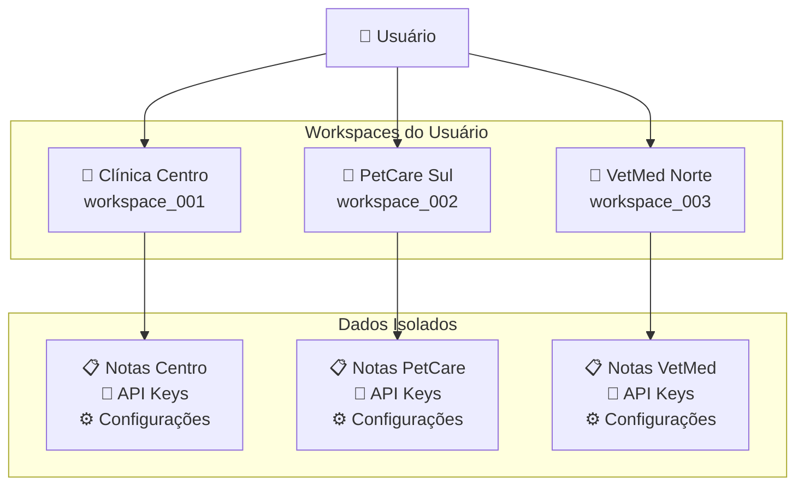

## O que são Tenants/Workspaces?

**Tenants** (chamados de **Workspaces** no frontend) são espaços isolados onde cada clínica veterinária gerencia suas consultas, notas e configurações de forma independente. É o núcleo do sistema multi-tenant do ConnectVets Notes.

<Info>
  **Backend** = "Tenant" | **Frontend** = "Workspace"
  
  Ambos se referem ao mesmo conceito: um espaço isolado para uma clínica veterinária.
</Info>

## Como Funcionam

### Arquitetura Multi-Tenant



### Isolamento de Dados

Cada workspace mantém **dados completamente isolados**:

| Recurso | Escopo | Exemplo |
|---------|--------|---------|
| **Notas** | Por workspace | Consultas da Clínica Centro ≠ PetCare |
| **API Keys** | Por workspace | Chave única para cada clínica |
| **Configurações** | Por workspace | Webhooks, integrações próprias |
| **Usuários** | Por workspace | Veterinários específicos da clínica |
| **Agentes IA** | Por workspace | Treinamentos personalizados |

## Criação de Workspaces

### Processo de Criação

<Steps>
  <Step title="Abrir Modal">
    Usuário clica em "Novo Workspace" no painel
  </Step>
  <Step title="Preencher Nome">
    Digite o nome da clínica (máx. 32 caracteres)
  </Step>
  <Step title="Validação">
    Sistema verifica permissões e plano ativo
  </Step>
  <Step title="Criação">
    Novo workspace é criado e selecionado automaticamente
  </Step>
</Steps>

### Restrições por Plano

<CardGroup cols={2}>
  <Card
    title="Plano Gratuito"
    icon="free"
  >
    - **1 workspace** incluído
    - Funcionalidades básicas
    - Limite de notas mensais
    - Sem criação adicional
  </Card>
  
  <Card
    title="Planos Pagos"
    icon="credit-card"
  >
    - **Múltiplos workspaces**
    - Sem limite de criação
    - Funcionalidades avançadas
    - Suporte prioritário
  </Card>
</CardGroup>

## Seleção e Troca de Workspaces

### Contexto de Autenticação

```javascript
// AuthContext - gerenciamento de tenants
const {
  currentTenant,      // Workspace atualmente selecionado
  tenants,           // Lista de todos os workspaces do usuário
  selectTenant,      // Função para trocar workspace
  createTenant       // Função para criar novo workspace
} = useAuth();
```

### Troca de Workspace

```javascript
// Exemplo de troca
const handleWorkspaceChange = (newWorkspaceId) => {
  const selectedWorkspace = tenants.find(t => t.id === newWorkspaceId);
  selectTenant(selectedWorkspace);
  
  // Automaticamente:
  // - Recarrega dados do novo workspace
  // - Atualiza API calls com novo tenant
  // - Redireciona para dashboard do workspace
};
```

## Exclusão de Workspaces

### Processo de Exclusão

<Warning>
  **Ação Irreversível**: A exclusão remove **TODOS** os dados do workspace, incluindo notas, configurações e agentes IA.
</Warning>

### Confirmação por Nome

<Steps>
  <Step title="Confirmação">
    Usuário deve digitar o **nome exato** do workspace
  </Step>
  <Step title="Validação">
    Sistema confirma que o nome confere
  </Step>
  <Step title="Exclusão">
    Remove todos os dados do workspace
  </Step>
  <Step title="Redirecionamento">
    Seleciona outro workspace disponível ou redireciona
  </Step>
</Steps>

## Integração com API

### Headers de Tenant

Cada requisição à API identifica o workspace ativo:

```bash
curl -X GET "https://api.connectvets.com.br/v1/notes" \
  -H "X-API-KEY: your_api_key" \
  -H "X-Tenant-ID: workspace_001"
```

### Exemplo de Integração

<CodeGroup>
```javascript JavaScript
// Configuração do cliente API
const api = axios.create({
  baseURL: 'https://api.connectvets.com.br/v1',
  headers: {
    'X-API-KEY': 'your_api_key',
    'X-Tenant-ID': currentTenant.id
  }
});

// Todas as requisições são automaticamente 
// scoped para o workspace atual
const notes = await api.get('/notes');
```

```python Python
import requests

# Session configurada com tenant
session = requests.Session()
session.headers.update({
    'X-API-KEY': 'your_api_key',
    'X-Tenant-ID': 'workspace_001'
})

# Todas as requisições usam o workspace
response = session.get('https://api.connectvets.com.br/v1/notes')
```

```bash cURL
# Definir tenant como variável
TENANT_ID="workspace_001"
API_KEY="your_api_key"

# Usar em todas as requisições
curl -X GET "https://api.connectvets.com.br/v1/notes" \
  -H "X-API-KEY: $API_KEY" \
  -H "X-Tenant-ID: $TENANT_ID"
```
</CodeGroup>

## Casos de Uso

### 1. Clínica Única

**Cenário**: Veterinário independente
- Um workspace para toda a clínica
- Simples e direto
- Sem necessidade de switching

### 2. Múltiplas Filiais

**Cenário**: Rede de clínicas
- Um workspace por filial
- Dados isolados por localização
- Relatórios centralizados possíveis

### 3. Veterinário Consultor

**Cenário**: Veterinário que atende várias clínicas
- Workspace para cada cliente
- Troca rápida entre contextos
- Dados seguros e isolados

### 4. Empresa de Software

**Cenário**: Sistema integrado a múltiplas clínicas
- Workspace por cliente final
- White-label personalizado
- Billing isolado por tenant

## Boas Práticas

### Nomeação de Workspaces

<Accordion title="Convenções Recomendadas">
  - **Clínica única**: Nome da clínica
  - **Múltiplas filiais**: "Clínica X - Filial Y"
  - **Departamentos**: "VetCorp - Emergência"
  - **Teste**: "Clínica Teste - Sandbox"
</Accordion>

### Gerenciamento de Dados

<Accordion title="Organização">
  - Use `external_id` para mapeamento entre sistemas
  - Mantenha metadados consistentes por workspace
  - Configure webhooks específicos por tenant
  - Implemente backup por workspace
</Accordion>

### Controle de Acesso

<Accordion title="Segurança">
  - API Keys únicas por workspace
  - Permissões granulares por usuário
  - Auditoria de acesso por tenant
  - Rotação regular de chaves
</Accordion>

## Limitações e Considerações

### Limites por Plano

| Plano | Workspaces | Notas/mês | Usuários | Webhooks |
|-------|------------|-----------|----------|----------|
| **Gratuito** | 1 | 50 | 2 | 1 |
| **Pro** | 5 | 1.000 | 10 | 5 |
| **Enterprise** | Ilimitado | 10.000+ | 50+ | 20+ |

### Performance

<Info>
  **Otimização**: Workspaces com muitos dados podem ter performance impactada. Use filtros e paginação adequadamente.
</Info>

### Backup e Restore

<Warning>
  **Responsabilidade**: Backup de dados é responsabilidade do usuário. Exporte dados importantes regularmente.
</Warning>

## Migração Entre Workspaces

### Processo de Migração

<Steps>
  <Step title="Exportação">
    Exporte dados do workspace de origem
  </Step>
  <Step title="Processamento">
    Ajuste IDs e referências se necessário
  </Step>
  <Step title="Importação">
    Importe dados no workspace de destino
  </Step>
  <Step title="Validação">
    Verifique integridade dos dados migrados
  </Step>
</Steps>

### Exemplo de Migração

```javascript
// Exportar notas de um workspace
const exportNotes = async (sourceWorkspace) => {
  const notes = await api.get('/notes', {
    headers: { 'X-Tenant-ID': sourceWorkspace }
  });
  
  return notes.data;
};

// Importar para outro workspace
const importNotes = async (targetWorkspace, notes) => {
  for (const note of notes) {
    await api.post('/notes', note, {
      headers: { 'X-Tenant-ID': targetWorkspace }
    });
  }
};
```

## Próximos Passos

<CardGroup cols={2}>
  <Card title="API Keys" icon="key" href="/concepts/api-keys">
    Configure autenticação por workspace
  </Card>
  <Card title="Webhooks" icon="webhook" href="/concepts/webhooks">
    Receba notificações por tenant
  </Card>
  <Card title="Integração" icon="puzzle-piece" href="/integration/onboarding">
    Implemente multi-tenancy em sua aplicação
  </Card>
  <Card title="Exemplos" icon="code" href="/examples/basic-integration">
    Veja implementações práticas
  </Card>
</CardGroup>

---

<Tip>
**Dúvidas sobre workspaces?** Entre em contato no [Discord](https://discord.gg/uN4NxUGk) ou [WhatsApp](https://wa.me/5531888835141).
</Tip> 