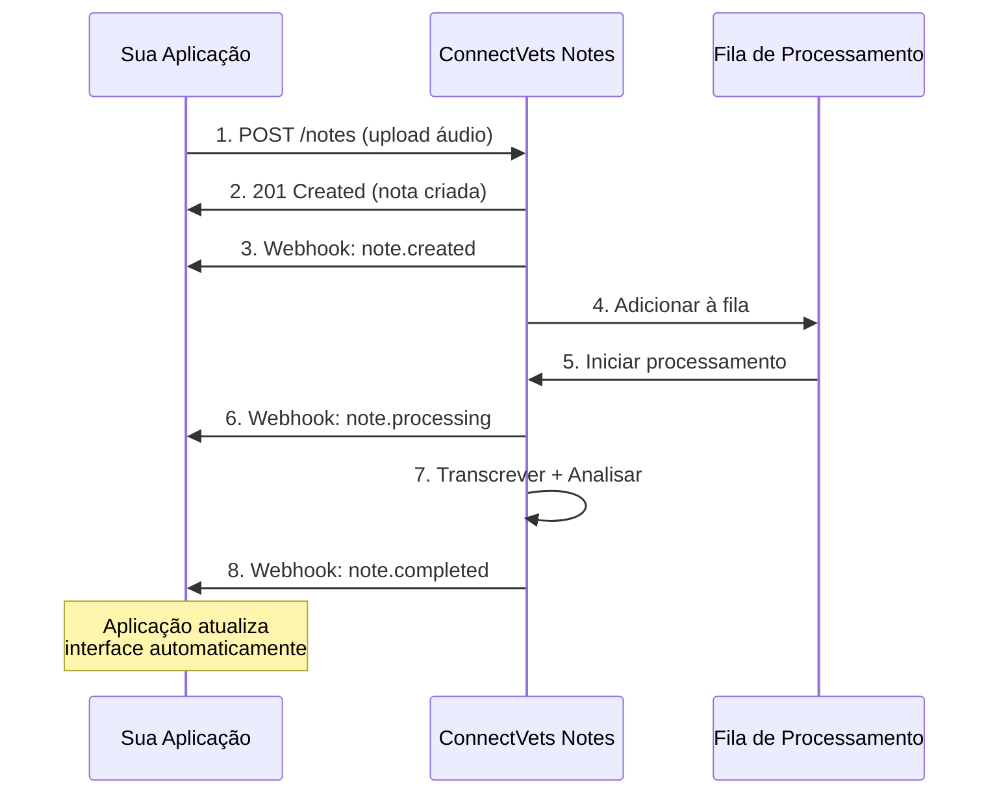

## O que são Webhooks?

**Webhooks** são notificações HTTP automáticas que o ConnectVets Notes envia para sua aplicação quando eventos importantes acontecem. Funcionam como "chamadas telefônicas" automáticas que avisam sobre mudanças em tempo real.

<Info>
  **Analogia**: Se a **API** é como "ligar para perguntar" o status, os **webhooks** são como "receber uma ligação" quando algo acontece.
</Info>

## Como Funcionam

### Fluxo do Webhook



### Ciclo de Vida de um Evento

<Steps>
  <Step title="Evento Ocorre">
    Algo importante acontece no ConnectVets (nota processada, erro, etc.)
  </Step>
  
  <Step title="Webhook Disparado">
    Sistema identifica que precisa notificar aplicações registradas
  </Step>
  
  <Step title="HTTP POST Enviado">
    ConnectVets faz POST para URL configurada com dados do evento
  </Step>
  
  <Step title="Aplicação Processa">
    Sua aplicação recebe, valida e processa a notificação
  </Step>
  
  <Step title="Resposta HTTP">
    Aplicação responde com status 200 confirmando recebimento
  </Step>
</Steps>

## Webhooks vs. Polling

### Comparação Técnica

| Aspecto | 🔔 **Webhooks** | 🔄 **Polling** |
|---------|----------------|----------------|
| **Latência** | < 1 segundo | 5-30 segundos |
| **Eficiência** | Alta (push) | Baixa (pull) |
| **Recursos** | Mínimos | Consome API calls |
| **Complexidade** | Média | Simples |
| **Confiabilidade** | Requer retry | Auto-retry nativo |
| **Tempo Real** | ✅ Verdadeiro | ❌ Simulado |

### Quando Usar Cada Um

<CardGroup cols={2}>
  <Card
    title="✅ Use Webhooks Quando"
    icon="check"
  >
    - **Tempo real** é crítico
    - **Eficiência** de recursos importa
    - **Volume alto** de notas
    - **UX responsivo** necessário
    - **Infraestrutura** robusta disponível
  </Card>
  
  <Card
    title="✅ Use Polling Quando"
    icon="clock"
  >
    - **Simplicidade** é prioridade
    - **Volume baixo** de notas
    - **Infraestrutura** limitada
    - **Desenvolvimento rápido** necessário
    - **Controle total** do timing
  </Card>
</CardGroup>

## Tipos de Eventos

### Eventos do Ciclo de Vida da Nota

<AccordionGroup>
  <Accordion title="📝 note.created">
    **Quando**: Nota criada com sucesso após upload
    
    **Use para**:
    - Confirmar recebimento do áudio
    - Criar registro no banco local
    - Notificar usuário sobre início
    - Atualizar interface (status "enviado")
    
    **Payload inclui**:
    ```json
    {
      "type": "note.created",
      "data": {
        "note": {
          "id": "note_abc123",
          "status": "pending",
          "metadata": { /* dados da consulta */ },
          "created_at": "2024-02-14T18:20:00Z"
        }
      }
    }
    ```
  </Accordion>
  
  <Accordion title="🔄 note.processing">
    **Quando**: Processamento efetivamente iniciado
    
    **Use para**:
    - Atualizar status na interface
    - Notificar sobre início do processamento
    - Registrar tempo de início
    - Ativar indicadores de progresso
    
    **Diferença do `created`**: 
    - `created` = nota aceita e na fila
    - `processing` = processamento começou
  </Accordion>
  
  <Accordion title="✅ note.completed">
    **Quando**: Processamento concluído com sucesso
    
    **Use para**:
    - **Atualizar prontuário** do paciente
    - **Notificar veterinário** sobre conclusão
    - **Enviar email** com resultados
    - **Exibir transcrição** e análise
    - **Integrar com sistemas** internos
    
    **Payload inclui**:
    - Transcrição completa
    - Seções estruturadas (resumo, diagnóstico, tratamento)
    - Metadados finais
    - Timestamps de processamento
  </Accordion>
  
  <Accordion title="❌ note.failed">
    **Quando**: Processamento falhou definitivamente
    
    **Use para**:
    - **Notificar sobre erro** ao usuário
    - **Registrar falha** para auditoria
    - **Alertar administrador** se necessário
    - **Implementar retry** manual se aplicável
    
    **Causas comuns**:
    - Áudio inaudível ou corrompido
    - Formato não suportado
    - Erro interno temporário
    - Violação de políticas de conteúdo
  </Accordion>
</AccordionGroup>

## Configuração de Webhooks

### Criar Webhook via Dashboard

<Steps>
  <Step title="Acesse Configurações">
    Vá para `https://notes.connectvets.com.br/settings/webhooks`
  </Step>
  
  <Step title="Adicione Nova URL">
    Clique em "Novo Webhook" e insira:
    - **URL**: Endpoint da sua aplicação
    - **Eventos**: Tipos de eventos para receber
    - **Descrição**: Nome identificador
  </Step>
  
  <Step title="Configure Segurança">
    Defina secret para validação de payload
  </Step>
  
  <Step title="Teste Conexão">
    Use função "Testar Webhook" para validar
  </Step>
</Steps>

### Criar Webhook via API

<CodeGroup>
```bash cURL
curl -X POST "https://api.connectvets.com.br/v1/webhooks" \
  -H "X-API-KEY: your_api_key" \
  -H "Content-Type: application/json" \
  -d '{
    "url": "https://seu-site.com/webhooks/connectvets",
    "events": ["note.created", "note.completed", "note.failed"],
    "description": "Webhook Sistema Principal",
    "secret": "webhook_secret_123"
  }'
```

```javascript JavaScript
const webhook = await fetch('https://api.connectvets.com.br/v1/webhooks', {
  method: 'POST',
  headers: {
    'X-API-KEY': 'your_api_key',
    'Content-Type': 'application/json'
  },
  body: JSON.stringify({
    url: 'https://seu-site.com/webhooks/connectvets',
    events: ['note.created', 'note.completed', 'note.failed'],
    description: 'Webhook Sistema Principal',
    secret: 'webhook_secret_123'
  })
});
```

```python Python
import requests

webhook_data = {
    'url': 'https://seu-site.com/webhooks/connectvets',
    'events': ['note.created', 'note.completed', 'note.failed'],
    'description': 'Webhook Sistema Principal',
    'secret': 'webhook_secret_123'
}

response = requests.post(
    'https://api.connectvets.com.br/v1/webhooks',
    headers={'X-API-KEY': 'your_api_key'},
    json=webhook_data
)
```
</CodeGroup>

## Implementação do Endpoint

### Estrutura Básica

<CodeGroup>
```javascript Node.js/Express
const express = require('express');
const crypto = require('crypto');

const app = express();
app.use(express.json());

// Endpoint para receber webhooks
app.post('/webhooks/connectvets', (req, res) => {
  const signature = req.headers['x-webhook-signature'];
  const payload = JSON.stringify(req.body);
  
  // Validar assinatura
  const expectedSignature = crypto
    .createHmac('sha256', process.env.WEBHOOK_SECRET)
    .update(payload)
    .digest('hex');
  
  if (signature !== `sha256=${expectedSignature}`) {
    return res.status(401).json({ error: 'Invalid signature' });
  }
  
  // Processar evento
  const { type, data } = req.body;
  
  switch (type) {
    case 'note.created':
      handleNoteCreated(data);
      break;
    case 'note.completed':
      handleNoteCompleted(data);
      break;
    case 'note.failed':
      handleNoteFailed(data);
      break;
    default:
      console.log('Evento desconhecido:', type);
  }
  
  res.status(200).json({ received: true });
});
```

```python Flask
from flask import Flask, request, jsonify
import hmac
import hashlib
import json

app = Flask(__name__)

@app.route('/webhooks/connectvets', methods=['POST'])
def webhook():
    signature = request.headers.get('X-Webhook-Signature')
    payload = request.get_data()
    
    # Validar assinatura
    expected_signature = hmac.new(
        WEBHOOK_SECRET.encode(),
        payload,
        hashlib.sha256
    ).hexdigest()
    
    if signature != f'sha256={expected_signature}':
        return jsonify({'error': 'Invalid signature'}), 401
    
    # Processar evento
    data = request.json
    event_type = data.get('type')
    
    if event_type == 'note.created':
        handle_note_created(data['data'])
    elif event_type == 'note.completed':
        handle_note_completed(data['data'])
    elif event_type == 'note.failed':
        handle_note_failed(data['data'])
    
    return jsonify({'received': True})
```
</CodeGroup>

### Tratamento de Eventos

<CodeGroup>
```javascript JavaScript
async function handleNoteCompleted(data) {
  const note = data.note;
  
  try {
    // Atualizar banco de dados local
    await updateNoteInDatabase(note.id, {
      status: 'completed',
      transcription: note.transcription,
      sections: note.sections,
      completed_at: new Date()
    });
    
    // Notificar usuário
    await sendNotificationToUser(note.user_id, {
      message: `Nota ${note.id} foi processada com sucesso`,
      type: 'success'
    });
    
    // Integrar com sistema de prontuário
    await updatePatientRecord(note.patient_id, note.sections);
    
  } catch (error) {
    console.error('Erro ao processar webhook:', error);
    // Implementar retry ou alerta
  }
}
```

```python Python
async def handle_note_completed(data):
    note = data['note']
    
    try:
        # Atualizar banco de dados local
        await update_note_in_database(note['id'], {
            'status': 'completed',
            'transcription': note['transcription'],
            'sections': note['sections'],
            'completed_at': datetime.now()
        })
        
        # Notificar usuário
        await send_notification_to_user(note['user_id'], {
            'message': f'Nota {note["id"]} foi processada com sucesso',
            'type': 'success'
        })
        
        # Integrar com sistema de prontuário
        await update_patient_record(note['patient_id'], note['sections'])
        
    except Exception as error:
        print(f'Erro ao processar webhook: {error}')
        # Implementar retry ou alerta
```
</CodeGroup>

## Segurança e Validação

### Validação de Assinatura

<CodeGroup>
```javascript JavaScript
function validateWebhookSignature(payload, signature, secret) {
  const expectedSignature = crypto
    .createHmac('sha256', secret)
    .update(payload)
    .digest('hex');
    
  return signature === `sha256=${expectedSignature}`;
}
```

```python Python
import hmac
import hashlib

def validate_webhook_signature(payload, signature, secret):
    expected_signature = hmac.new(
        secret.encode(),
        payload,
        hashlib.sha256
    ).hexdigest()
    
    return signature == f'sha256={expected_signature}'
```
</CodeGroup>

### Tratamento de Erros

<Accordion title="Retry Logic">
  ConnectVets implementa retry automático:
  - **Tentativas**: 3 tentativas com backoff exponencial
  - **Timeout**: 30 segundos por tentativa
  - **Backoff**: 2s, 4s, 8s entre tentativas
  - **Desabilitação**: Após 5 falhas consecutivas
</Accordion>

<Accordion title="Códigos de Resposta">
  - **200**: Webhook processado com sucesso
  - **201**: Webhook recebido e será processado
  - **400**: Payload inválido
  - **401**: Assinatura inválida
  - **500**: Erro interno - ConnectVets tentará novamente
</Accordion>

## Monitoramento e Debug

### Logs de Webhook

Acesse `https://notes.connectvets.com.br/settings/webhooks` para visualizar:

- **Histórico** de entregas
- **Status** de cada tentativa
- **Payload** enviado
- **Resposta** recebida
- **Tempo** de processamento

### Teste de Webhooks

<CodeGroup>
```bash Teste Manual
# Simular webhook localmente
curl -X POST "http://localhost:3000/webhooks/connectvets" \
  -H "Content-Type: application/json" \
  -H "X-Webhook-Signature: sha256=..." \
  -d '{
    "type": "note.completed",
    "data": {
      "note": {
        "id": "note_test_123",
        "status": "completed"
      }
    }
  }'
```

```javascript Teste Automatizado
// Teste unitário para webhook
const request = require('supertest');
const app = require('./app');

describe('Webhook ConnectVets', () => {
  it('should handle note.completed event', async () => {
    const payload = {
      type: 'note.completed',
      data: { note: { id: 'test_123', status: 'completed' } }
    };
    
    const response = await request(app)
      .post('/webhooks/connectvets')
      .send(payload)
      .expect(200);
      
    expect(response.body.received).toBe(true);
  });
});
```
</CodeGroup>

## Próximos Passos

<CardGroup cols={2}>
  <Card title="API Keys" icon="key" href="/concepts/api-keys">
    Configure autenticação adequada
  </Card>
  <Card title="Tenants" icon="building" href="/concepts/tenants">
    Organize webhooks por workspace
  </Card>
  <Card title="Integração" icon="puzzle-piece" href="/integration/onboarding">
    Implemente em sua aplicação
  </Card>
  <Card title="Exemplos" icon="code" href="/examples/webhook-handling">
    Veja implementações completas
  </Card>
</CardGroup>

---

<Tip>
**Problemas com webhooks?** Consulte os logs no dashboard ou entre em contato no [Discord](https://discord.gg/uN4NxUGk).
</Tip> 