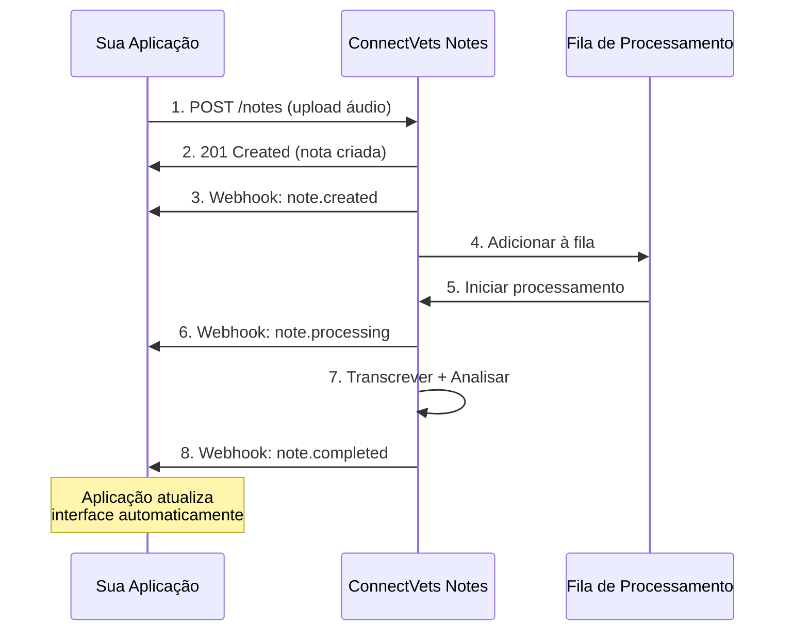

## O que são Webhooks?

**Webhooks** são notificações HTTP automáticas que o ConnectVets Notes envia para sua aplicação quando eventos importantes acontecem. Funcionam como "chamadas telefônicas" automáticas que avisam sobre mudanças em tempo real.

<Info>
  **Analogia**: Se a **API** é como "ligar para perguntar" o status, os **webhooks** são como "receber uma ligação" quando algo acontece.
</Info>

## Como Funcionam

### Fluxo do Webhook



### Ciclo de Vida de um Evento

<Steps>
  <Step title="Evento Ocorre">
    Algo importante acontece no ConnectVets (nota processada, erro, etc.)
  </Step>
  
  <Step title="Webhook Disparado">
    Sistema identifica que precisa notificar aplicações registradas
  </Step>
  
  <Step title="HTTP POST Enviado">
    ConnectVets faz POST para URL configurada com dados do evento
  </Step>
  
  <Step title="Aplicação Processa">
    Sua aplicação recebe, valida e processa a notificação
  </Step>
  
  <Step title="Resposta HTTP">
    Aplicação responde com status 200 confirmando recebimento
  </Step>
</Steps>

## Webhooks vs. Polling

### Comparação Técnica

| Aspecto | 🔔 **Webhooks** | 🔄 **Polling** |
|---------|----------------|----------------|
| **Latência** | &lt; 1 segundo | 5-30 segundos |
| **Eficiência** | Alta (push) | Baixa (pull) |
| **Recursos** | Mínimos | Consome API calls |
| **Complexidade** | Média | Simples |
| **Confiabilidade** | Requer retry | Auto-retry nativo |
| **Tempo Real** | ✅ Verdadeiro | ❌ Simulado |

### Quando Usar Cada Um

<CardGroup cols={2}>
  <Card
    title="✅ Use Webhooks Quando"
    icon="check"
  >
    - **Tempo real** é crítico
    - **Eficiência** de recursos importa
    - **Volume alto** de notas
    - **UX responsivo** necessário
    - **Infraestrutura** robusta disponível
  </Card>
  
  <Card
    title="✅ Use Polling Quando"
    icon="clock"
  >
    - **Simplicidade** é prioridade
    - **Volume baixo** de notas
    - **Infraestrutura** limitada
    - **Desenvolvimento rápido** necessário
    - **Controle total** do timing
  </Card>
</CardGroup>

## Tipos de Eventos

### Eventos do Ciclo de Vida da Nota

<AccordionGroup>
  <Accordion title="📝 note.created">
    **Quando**: Nota criada com sucesso após upload
    
    **Use para**:
    - Confirmar recebimento do áudio
    - Criar registro no banco local
    - Notificar usuário sobre início
    - Atualizar interface (status "enviado")
    
    **Payload inclui**:
    ```json
    {
      "type": "note.created",
      "data": {
        "note": {
          "id": "note_abc123",
          "status": "pending",
          "metadata": { /* dados da consulta */ },
          "created_at": "2024-02-14T18:20:00Z"
        }
      }
    }
    ```
  </Accordion>
  
  <Accordion title="🔄 note.processing">
    **Quando**: Processamento efetivamente iniciado
    
    **Use para**:
    - Atualizar status na interface
    - Notificar sobre início do processamento
    - Registrar tempo de início
    - Ativar indicadores de progresso
    
    **Diferença do `created`**: 
    - `created` = nota aceita e na fila
    - `processing` = processamento começou
  </Accordion>
  
  <Accordion title="✅ note.completed">
    **Quando**: Processamento concluído com sucesso
    
    **Use para**:
    - **Atualizar prontuário** do paciente
    - **Notificar veterinário** sobre conclusão
    - **Enviar email** com resultados
    - **Exibir transcrição** e análise
    - **Integrar com sistemas** internos
    
    **Payload inclui**:
    - Transcrição completa
    - Seções estruturadas (resumo, diagnóstico, tratamento)
    - Metadados finais
    - Timestamps de processamento
  </Accordion>
  
  <Accordion title="❌ note.failed">
    **Quando**: Processamento falhou definitivamente
    
    **Use para**:
    - **Notificar sobre erro** ao usuário
    - **Registrar falha** para auditoria
    - **Alertar administrador** se necessário
    - **Implementar retry** manual se aplicável
    
    **Causas comuns**:
    - Áudio inaudível ou corrompido
    - Formato não suportado
    - Erro interno temporário
    - Violação de políticas de conteúdo
  </Accordion>
  
  <Accordion title="📝 note.updated">
    **Quando**: Nota modificada manualmente
    
    **Use para**:
    - Sincronizar alterações manuais
    - Manter histórico de mudanças
    - Notificar sobre correções
    - Atualizar caches locais
    
    **Cenários**:
    - Correção manual da transcrição
    - Atualização de metadados
    - Reprocessamento manual
  </Accordion>
</AccordionGroup>

### Eventos do Sistema

<AccordionGroup>
  <Accordion title="🔑 api_key.revoked">
    **Quando**: API key foi revogada ou expirou
    
    **Use para**:
    - Parar operações automaticamente
    - Notificar administrador urgentemente
    - Redirecionar para renovação
    - Registrar evento de segurança
  </Accordion>
  
  <Accordion title="💰 quota.exceeded">
    **Quando**: Cota mensal foi excedida
    
    **Use para**:
    - Bloquear novas submissões
    - Notificar sobre limite atingido
    - Sugerir upgrade de plano
    - Agendar renovação automática
  </Accordion>
  
  <Accordion title="🏥 workspace.updated">
    **Quando**: Configurações do workspace mudaram
    
    **Use para**:
    - Atualizar configurações locais
    - Sincronizar permissões
    - Revalidar acessos
    - Atualizar interface
  </Accordion>
</AccordionGroup>

## Configuração e Gerenciamento

### Anatomia de um Webhook

```json
{
  "id": "wh_1234567890abcdef",
  "url": "https://meuapp.com/webhooks/connectvets",
  "events": [
    "note.created",
    "note.completed", 
    "note.failed"
  ],
  "secret": "whsec_abc123def456...",
  "active": true,
  "description": "Webhook principal do sistema",
  "created_at": "2024-02-14T18:00:00Z",
  "last_triggered": "2024-02-14T19:30:15Z",
  "success_rate": 98.5,
  "retry_policy": {
    "max_attempts": 3,
    "backoff_strategy": "exponential"
  }
}
```

### Estratégias de Configuração

<CardGroup cols={2}>
  <Card
    title="🎯 Webhook Específico"
    icon="target"
  >
    **Um webhook por tipo de evento**
    
    - `/webhooks/notes/created`
    - `/webhooks/notes/completed`
    - `/webhooks/notes/failed`
    
    **Vantagens**: Lógica separada, debug fácil
    **Desvantagens**: Mais endpoints para manter
  </Card>
  
  <Card
    title="🌐 Webhook Universal"
    icon="globe"
  >
    **Um webhook para todos os eventos**
    
    - `/webhooks/connectvets`
    
    **Vantagens**: Simples de configurar
    **Desvantagens**: Lógica mais complexa
  </Card>
</CardGroup>

### Configuração por Ambiente

```javascript
// Configuração recomendada por ambiente
const webhookConfigs = {
  development: {
    url: 'https://ngrok-tunnel.ngrok.io/webhooks/connectvets',
    events: ['note.completed'], // Apenas eventos essenciais
    secret: 'dev_secret_123'
  },
  
  staging: {
    url: 'https://staging.meuapp.com/webhooks/connectvets',
    events: ['note.created', 'note.completed', 'note.failed'],
    secret: 'staging_secret_456'
  },
  
  production: {
    url: 'https://meuapp.com/webhooks/connectvets',
    events: [
      'note.created', 'note.processing', 'note.completed', 
      'note.failed', 'api_key.revoked', 'quota.exceeded'
    ],
    secret: 'prod_secret_ultra_secure_789'
  }
};
```

## Segurança e Validação

### Verificação de Assinatura

```javascript
// Por que verificar assinatura?
const securityReasons = {
  authentication: "Confirmar que o webhook veio do ConnectVets",
  integrity: "Garantir que dados não foram modificados",
  replay_protection: "Evitar ataques de replay",
  spoofing_prevention: "Impedir webhooks falsos"
};

// Como verificar
function verifyWebhookSignature(payload, signature, secret) {
  const expectedSignature = crypto
    .createHmac('sha256', secret)
    .update(payload)
    .digest('hex');
  
  const receivedSignature = signature.replace('sha256=', '');
  
  // Comparação timing-safe (evita timing attacks)
  return crypto.timingSafeEqual(
    Buffer.from(expectedSignature, 'hex'),
    Buffer.from(receivedSignature, 'hex')
  );
}
```

### Headers de Segurança

```http
POST /webhooks/connectvets HTTP/1.1
Host: meuapp.com
Content-Type: application/json
X-ConnectVets-Signature: sha256=abc123def456...
X-ConnectVets-Event: note.completed
X-ConnectVets-Delivery: 12345678-1234-1234-1234-123456789abc
X-ConnectVets-Timestamp: 1708024543
User-Agent: ConnectVets-Webhooks/1.0
```

| Header | Descrição | Uso |
|--------|-----------|-----|
| `X-ConnectVets-Signature` | Assinatura HMAC-SHA256 | **Validação obrigatória** |
| `X-ConnectVets-Event` | Tipo do evento | Roteamento rápido |
| `X-ConnectVets-Delivery` | ID único da entrega | Deduplicação |
| `X-ConnectVets-Timestamp` | Timestamp Unix | Proteção contra replay |

## Padrões de Implementação

### Padrão Básico: Handler Simples

```javascript
// Para aplicações pequenas
app.post('/webhooks/connectvets', (req, res) => {
  const event = req.body;
  
  switch (event.type) {
    case 'note.completed':
      updatePatientRecord(event.data.note);
      break;
    case 'note.failed':
      logError(event.data.note);
      break;
  }
  
  res.status(200).send('OK');
});
```

### Padrão Avançado: Sistema de Eventos

```javascript
// Para aplicações robustas
class WebhookEventSystem {
  constructor() {
    this.handlers = new Map();
    this.middleware = [];
  }
  
  // Registrar handler
  on(eventType, handler) {
    if (!this.handlers.has(eventType)) {
      this.handlers.set(eventType, []);
    }
    this.handlers.get(eventType).push(handler);
  }
  
  // Middleware (validação, logging, etc.)
  use(middleware) {
    this.middleware.push(middleware);
  }
  
  // Processar evento
  async emit(event) {
    // Executar middleware
    for (const middleware of this.middleware) {
      await middleware(event);
    }
    
    // Executar handlers
    const handlers = this.handlers.get(event.type) || [];
    await Promise.all(handlers.map(handler => handler(event)));
  }
}

// Uso
const webhookSystem = new WebhookEventSystem();

webhookSystem.use(validateSignature);
webhookSystem.use(logEvent);
webhookSystem.use(deduplicateEvent);

webhookSystem.on('note.completed', updatePatientRecord);
webhookSystem.on('note.completed', notifyVeterinarian);
webhookSystem.on('note.completed', sendCompletionEmail);
```

### Padrão Enterprise: Message Queue

```javascript
// Para alta escala e confiabilidade
class WebhookProcessor {
  constructor(queue) {
    this.queue = queue; // Redis, RabbitMQ, AWS SQS, etc.
  }
  
  // Receber webhook (rápido)
  async receiveWebhook(req, res) {
    try {
      // Validação básica e rápida
      this.validateRequest(req);
      
      // Adicionar à fila para processamento assíncrono
      await this.queue.add('process-webhook', {
        headers: req.headers,
        body: req.body,
        timestamp: Date.now()
      });
      
      // Responder imediatamente
      res.status(200).send('Queued');
      
    } catch (error) {
      res.status(400).json({ error: error.message });
    }
  }
  
  // Processar webhook (assíncrono)
  async processWebhook(job) {
    const { headers, body } = job.data;
    
    // Validação completa
    await this.fullValidation(headers, body);
    
    // Processamento business logic
    await this.handleEvent(body);
    
    // Marcar como processado
    await this.markAsProcessed(body.id);
  }
}
```

## Monitoramento e Observabilidade

### Métricas Importantes

<CardGroup cols={2}>
  <Card
    title="📊 Métricas de Entrega"
    icon="chart-line"
  >
    - **Taxa de sucesso** (target: >99%)
    - **Latência de entrega** (target: &lt;2s)
    - **Taxa de retry** (target: &lt;5%)
    - **Eventos perdidos** (target: 0)
  </Card>
  
  <Card
    title="⚡ Métricas de Performance"
    icon="zap"
  >
    - **Tempo de processamento** (target: &lt;1s)
    - **Throughput** (eventos/segundo)
    - **Memory/CPU usage**
    - **Tempo de resposta** HTTP
  </Card>
</CardGroup>

### Dashboard de Webhooks

```javascript
// Métricas que devem ser monitoradas
const webhookMetrics = {
  delivery: {
    total_sent: 15847,
    successful: 15691,
    failed: 156,
    success_rate: 99.01 // %
  },
  
  performance: {
    avg_response_time: 245, // ms
    p95_response_time: 890, // ms
    avg_payload_size: 2.3, // KB
    throughput: 125 // eventos/min
  },
  
  errors: {
    timeout_count: 23,
    http_errors: {
      '400': 12,
      '500': 8,
      '503': 5
    },
    signature_failures: 2
  },
  
  recent_events: [
    { type: 'note.completed', timestamp: '2024-02-14T19:45:32Z', status: 'success' },
    { type: 'note.failed', timestamp: '2024-02-14T19:45:28Z', status: 'success' },
    // ...
  ]
};
```

## Troubleshooting e Debug

### Problemas Comuns

<AccordionGroup>
  <Accordion title="🚫 Webhooks não chegam">
    **Possíveis causas:**
    - URL incorreta ou inacessível
    - Firewall bloqueando ConnectVets
    - Webhook desativado
    - Evento não inscrito
    
    **Debug:**
    ```bash
    # Testar acessibilidade
    curl -X POST https://meuapp.com/webhooks/connectvets \
         -H "Content-Type: application/json" \
         -d '{"test": true}'
    
    # Verificar logs do servidor
    tail -f /var/log/webhook.log
    
    # Testar webhook via dashboard
    POST /webhooks/{id}/test
    ```
  </Accordion>
  
  <Accordion title="❌ Falhas de assinatura">
    **Possíveis causas:**
    - Secret incorreto
    - Modificação do payload
    - Codificação de caracteres
    - Timing de verificação
    
    **Debug:**
    ```javascript
    // Log detalhado da verificação
    console.log('Received signature:', req.headers['x-connectvets-signature']);
    console.log('Payload:', req.rawBody);
    console.log('Expected signature:', expectedSignature);
    console.log('Secret used:', webhookSecret.substring(0, 8) + '...');
    ```
  </Accordion>
  
  <Accordion title="🐌 Timeouts frequentes">
    **Possíveis causas:**
    - Processamento muito lento
    - Operações síncronas pesadas
    - Dependências externas lentas
    - Recursos insuficientes
    
    **Soluções:**
    ```javascript
    // Responder rapidamente + processar async
    app.post('/webhooks', (req, res) => {
      res.status(200).send('OK'); // Responder primeiro
      
      // Processar depois
      setImmediate(() => {
        processWebhookAsync(req.body);
      });
    });
    ```
  </Accordion>
</AccordionGroup>

### Ferramentas de Debug

```javascript
// Webhook debugger para desenvolvimento
class WebhookDebugger {
  constructor() {
    this.events = [];
    this.maxEvents = 100;
  }
  
  logEvent(event, metadata = {}) {
    this.events.unshift({
      ...event,
      debug: {
        timestamp: new Date(),
        headers: metadata.headers,
        signature_valid: metadata.signatureValid,
        processing_time: metadata.processingTime
      }
    });
    
    // Manter apenas últimos eventos
    if (this.events.length > this.maxEvents) {
      this.events = this.events.slice(0, this.maxEvents);
    }
  }
  
  getRecentEvents(count = 20) {
    return this.events.slice(0, count);
  }
  
  getEventStats() {
    return {
      total: this.events.length,
      by_type: this.groupBy(this.events, 'type'),
      avg_processing_time: this.average(this.events, 'debug.processing_time')
    };
  }
}
```

## Migração: Polling → Webhooks

### Estratégia de Migração

<Steps>
  <Step title="Fase 1: Implementação Paralela">
    Manter polling existente + implementar webhooks
    - Webhooks para eventos críticos
    - Polling como backup/fallback
  </Step>
  
  <Step title="Fase 2: Validação">
    Comparar resultados entre polling e webhooks
    - Verificar consistência de dados
    - Medir performance e confiabilidade
  </Step>
  
  <Step title="Fase 3: Transição Gradual">
    Migrar funcionalidades uma por uma
    - Começar com funcionalidades menos críticas
    - Monitorar métricas atentamente
  </Step>
  
  <Step title="Fase 4: Desativação do Polling">
    Remover polling quando webhooks estiverem estáveis
    - Manter como emergency fallback
    - Documentar processo de rollback
  </Step>
</Steps>

### Código de Migração

```javascript
class HybridNotificationSystem {
  constructor() {
    this.useWebhooks = process.env.USE_WEBHOOKS === 'true';
    this.pollingInterval = 30000; // 30s fallback
  }
  
  async processNote(noteId) {
    if (this.useWebhooks) {
      // Webhook mode: apenas aguardar notificação
      return this.waitForWebhook(noteId);
    } else {
      // Polling mode: verificar status periodicamente
      return this.pollNoteStatus(noteId);
    }
  }
  
  async waitForWebhook(noteId, timeout = 300000) {
    return new Promise((resolve, reject) => {
      // Configurar listener para webhook
      this.once(`note.completed.${noteId}`, resolve);
      this.once(`note.failed.${noteId}`, reject);
      
      // Timeout como fallback
      setTimeout(() => {
        reject(new Error('Webhook timeout'));
      }, timeout);
    });
  }
  
  // Fallback para polling em caso de falha de webhook
  async emergencyPolling(noteId) {
    console.warn('🚨 Fallback para polling devido a falha de webhook');
    return this.pollNoteStatus(noteId);
  }
}
```

## Próximos Passos

<CardGroup cols={2}>
  <Card
    title="Webhook Handling"
    icon="webhook"
    href="/examples/webhook-handling"
  >
    Implementação prática completa
  </Card>
  <Card
    title="API Keys"
    icon="key"
    href="/concepts/api-keys"
  >
    Como funcionam as chaves de API
  </Card>
  <Card
    title="Tenants e Workspaces"
    icon="building"
    href="/concepts/tenants"
  >
    Sistema multi-tenant
  </Card>
  <Card
    title="Error Handling"
    icon="alert-triangle"
    href="/integration/error-handling"
  >
    Tratamento robusto de erros
  </Card>
</CardGroup> 