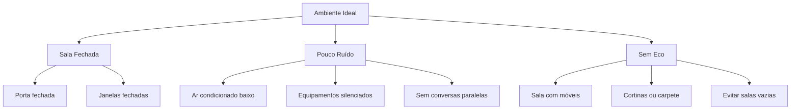

## Visão Geral

O **ConnectVets Notes** processa arquivos de áudio de consultas veterinárias para gerar transcrições e análises estruturadas. A qualidade do áudio impacta diretamente na precisão dos resultados.

<Info>
  **Recomendação**: Áudios de **boa qualidade** resultam em transcrições **95%+ precisas** e análises mais detalhadas.
</Info>

## Formatos Suportados

### Formatos Aceitos

| Formato | Extensão | Recomendado | Qualidade | Tamanho |
|---------|----------|-------------|-----------|---------|
| **MP3** | `.mp3` | ✅ **SIM** | Boa | Médio |
| **WAV** | `.wav` | ⭐ **IDEAL** | Excelente | Grande |
| **M4A** | `.m4a` | ✅ **SIM** | Boa | Médio |
| **AAC** | `.aac` | ✅ **SIM** | Boa | Pequeno |
| **OGG** | `.ogg` | ⚠️ Limitado | Boa | Médio |
| **WEBM** | `.webm` | ⚠️ Limitado | Boa | Médio |

### Formato Recomendado: WAV

```bash
# Especificações ideais para WAV
Formato: WAV (PCM)
Sample Rate: 44.1 kHz ou 48 kHz
Bit Depth: 16-bit ou 24-bit
Canais: Mono ou Estéreo
Duração máxima: 60 minutos
Tamanho máximo: 100 MB
```

## Especificações Técnicas

### Qualidade de Áudio

<CardGroup cols={2}>
  <Card
    title="Requisitos Mínimos"
    icon="volume-1"
  >
    - **Sample Rate**: 16 kHz+
    - **Bit Depth**: 16-bit+
    - **Duração**: 10 segundos - 60 minutos
    - **Tamanho**: Máximo 100 MB
    - **SNR**: 15 dB+ (Signal-to-Noise Ratio)
  </Card>
  
  <Card
    title="Configuração Ideal"
    icon="volume-2"
  >
    - **Sample Rate**: 44.1 kHz ou 48 kHz
    - **Bit Depth**: 24-bit
    - **Duração**: 5-45 minutos
    - **Tamanho**: 20-80 MB
    - **SNR**: 25 dB+
  </Card>
</CardGroup>

### Limitações de Tamanho

```javascript
// Validação de arquivo no frontend
function validateAudioFile(file) {
  const maxSize = 100 * 1024 * 1024; // 100 MB
  const minSize = 1 * 1024; // 1 KB
  const supportedFormats = ['mp3', 'wav', 'm4a', 'aac'];
  
  // Verificar tamanho
  if (file.size > maxSize) {
    return { 
      valid: false, 
      error: 'Arquivo muito grande. Máximo: 100 MB' 
    };
  }
  
  if (file.size < minSize) {
    return { 
      valid: false, 
      error: 'Arquivo muito pequeno. Mínimo: 1 KB' 
    };
  }
  
  // Verificar formato
  const extension = file.name.toLowerCase().split('.').pop();
  if (!supportedFormats.includes(extension)) {
    return { 
      valid: false, 
      error: `Formato não suportado. Use: ${supportedFormats.join(', ')}` 
    };
  }
  
  return { valid: true };
}

// Uso da validação
const fileInput = document.getElementById('audio-file');
fileInput.addEventListener('change', (event) => {
  const file = event.target.files[0];
  const validation = validateAudioFile(file);
  
  if (!validation.valid) {
    alert(validation.error);
    return;
  }
  
  // Arquivo válido, prosseguir com upload
  uploadAudio(file);
});
```

## Configuração de Gravação

### Configurações do Microfone

<AccordionGroup>
  <Accordion title="🎤 Microfone Dedicado (Recomendado)">
    **Ideal para clínicas:**
    - Microfone condensador ou dinâmico
    - Distância: 15-30 cm da boca
    - Padrão polar: Cardioide ou supercardioide
    - Redução de ruído ativa
    
    **Exemplos:**
    - Audio-Technica ATR2100x-USB
    - Blue Yeti ou Blue Yeti Nano
    - Shure SM58 (com interface)
    - Rode PodMic
  </Accordion>
  
  <Accordion title="📱 Dispositivos Móveis">
    **Para gravação móvel:**
    - iPhone: Usar app de gravação nativo
    - Android: Usar Google Recorder ou similar
    - Configurar qualidade máxima
    - Segurar device a 20-30 cm
    
    **Configurações iOS:**
    ```
    Configurações > Gravação de Voz
    Qualidade: Sem Compressão
    Formato: WAV (se disponível)
    ```
    
    **Configurações Android:**
    ```
    Configurações do App de Gravação
    Qualidade: Alta (48kHz/24-bit)
    Formato: WAV ou FLAC
    ```
  </Accordion>
  
  <Accordion title="💻 Headset/Fone com Microfone">
    **Para uso ocasional:**
    - Headset com microfone integrado
    - Posicionar mic próximo à boca
    - Evitar microfones muito baratos
    
    **Modelos recomendados:**
    - SteelSeries Arctis 7
    - HyperX Cloud II
    - Logitech G Pro X
  </Accordion>
</AccordionGroup>

### Ambiente de Gravação



### Configuração de Software

<CodeGroup>

```javascript WebRTC (Browser)
// Configuração para gravação no navegador
async function configureAudioRecording() {
  const constraints = {
    audio: {
      sampleRate: 48000,        // Sample rate alto
      channelCount: 1,          // Mono (suficiente para voz)
      echoCancellation: true,   // Cancelamento de eco
      noiseSuppression: true,   // Supressão de ruído
      autoGainControl: true,    // Controle automático de ganho
      sampleSize: 16            // 16-bit depth
    }
  };
  
  try {
    const stream = await navigator.mediaDevices.getUserMedia(constraints);
    const mediaRecorder = new MediaRecorder(stream, {
      mimeType: 'audio/webm;codecs=opus',
      audioBitsPerSecond: 128000  // 128 kbps
    });
    
    return mediaRecorder;
  } catch (error) {
    console.error('Erro ao configurar gravação:', error);
  }
}
```

```javascript React Native
// Configuração para React Native
import { AudioRecorder, AudioUtils } from 'react-native-audio';

const audioPath = AudioUtils.DocumentDirectoryPath + '/consultation.wav';

const audioSettings = {
  SampleRate: 48000,
  Channels: 1,
  AudioQuality: 'High',
  AudioEncoding: 'wav',
  OutputFormat: 'wav',
  MeteringEnabled: true,
  IncludeBase64: false,
  AudioEncodingBitRate: 256000
};

// Iniciar gravação
AudioRecorder.prepareRecordingAtPath(audioPath, audioSettings);
AudioRecorder.startRecording();
```

```python Python (pyaudio)
import pyaudio
import wave

# Configuração para gravação desktop
def configure_audio_recording():
    chunk = 1024
    format = pyaudio.paInt16    # 16-bit
    channels = 1                # Mono
    rate = 48000               # 48kHz sample rate
    
    audio = pyaudio.PyAudio()
    
    stream = audio.open(
        format=format,
        channels=channels,
        rate=rate,
        input=True,
        frames_per_buffer=chunk
    )
    
    return audio, stream, (chunk, format, channels, rate)

# Gravar áudio
def record_audio(duration_seconds):
    audio, stream, config = configure_audio_recording()
    chunk, format, channels, rate = config
    
    frames = []
    
    for _ in range(0, int(rate / chunk * duration_seconds)):
        data = stream.read(chunk)
        frames.append(data)
    
    # Salvar arquivo
    with wave.open('consultation.wav', 'wb') as wf:
        wf.setnchannels(channels)
        wf.setsampwidth(audio.get_sample_size(format))
        wf.setframerate(rate)
        wf.writeframes(b''.join(frames))
    
    stream.close()
    audio.terminate()
```

</CodeGroup>

## Otimização de Áudio

### Pré-processamento

```javascript
// Normalizar volume do áudio antes de enviar
async function normalizeAudio(audioBlob) {
  const audioContext = new AudioContext();
  const arrayBuffer = await audioBlob.arrayBuffer();
  const audioBuffer = await audioContext.decodeAudioData(arrayBuffer);
  
  // Encontrar pico máximo
  const channelData = audioBuffer.getChannelData(0);
  let maxPeak = 0;
  
  for (let i = 0; i < channelData.length; i++) {
    const sample = Math.abs(channelData[i]);
    if (sample > maxPeak) {
      maxPeak = sample;
    }
  }
  
  // Normalizar se necessário
  if (maxPeak > 0 && maxPeak < 0.95) {
    const normalizeRatio = 0.95 / maxPeak;
    
    for (let i = 0; i < channelData.length; i++) {
      channelData[i] *= normalizeRatio;
    }
  }
  
  return audioBuffer;
}
```

### Compressão Inteligente

```bash
# Usando FFmpeg para otimizar áudio
# Converter para formato ideal mantendo qualidade

# MP3 de alta qualidade
ffmpeg -i input.wav -c:a libmp3lame -b:a 192k -ar 48000 output.mp3

# WAV otimizado 
ffmpeg -i input.wav -c:a pcm_s16le -ar 48000 -ac 1 output.wav

# M4A de alta qualidade
ffmpeg -i input.wav -c:a aac -b:a 256k -ar 48000 output.m4a

# Reduzir ruído de fundo
ffmpeg -i input.wav -af "afftdn=nf=-40" output_clean.wav
```

## Casos de Uso Específicos

### Consulta Individual

```javascript
// Configuração para consulta 1:1 (veterinário + dono)
const consultationConfig = {
  environment: 'quiet_room',
  participants: 2,
  microphoneDistance: '20-30cm',
  recordingDuration: '10-30 minutes',
  recommendedFormat: 'WAV 48kHz/16-bit',
  
  settings: {
    echoCancellation: true,
    noiseSuppression: true,
    autoGainControl: true
  }
};
```

### Cirurgia

```javascript
// Configuração para ambiente cirúrgico
const surgeryConfig = {
  environment: 'operating_room',
  participants: '3-5',
  challenges: ['equipment_noise', 'air_conditioning', 'multiple_speakers'],
  microphoneDistance: '15-25cm',
  recordingDuration: '30-120 minutes',
  recommendedFormat: 'WAV 48kHz/24-bit',
  
  settings: {
    echoCancellation: false,    // Pode interferir com múltiplas vozes
    noiseSuppression: true,
    autoGainControl: false,     // Manter ganho fixo
    manualGain: 0.7
  }
};
```

### Telemedicina

```javascript
// Configuração para consultas remotas
const telemedicineConfig = {
  environment: 'home_office',
  participants: 2,
  challenges: ['internet_latency', 'compression', 'echo'],
  recordingSource: 'video_call_recording',
  recommendedFormat: 'MP3 192kbps+',
  
  preprocessing: {
    noiseReduction: true,
    volumeNormalization: true,
    echoRemoval: true
  }
};
```

## Resolução de Problemas

### Problemas Comuns

<AccordionGroup>
  <Accordion title="🔇 Áudio Muito Baixo">
    **Sintomas:**
    - Transcrição incompleta
    - Erro: "Audio volume too low"
    
    **Soluções:**
    ```javascript
    // Verificar nível antes de enviar
    function checkAudioLevel(audioBuffer) {
      const channelData = audioBuffer.getChannelData(0);
      let rms = 0;
      
      for (let i = 0; i < channelData.length; i++) {
        rms += channelData[i] * channelData[i];
      }
      
      rms = Math.sqrt(rms / channelData.length);
      
      if (rms < 0.01) {
        return { 
          status: 'too_low', 
          message: 'Aumentar volume do microfone' 
        };
      }
      
      return { status: 'ok' };
    }
    ```
    
    **Ajustes:**
    - Aproximar microfone
    - Aumentar ganho do sistema
    - Falar mais alto/claro
  </Accordion>
  
  <Accordion title="📢 Áudio Muito Alto/Distorcido">
    **Sintomas:**
    - Clipping/distorção
    - Erro: "Audio clipping detected"
    
    **Soluções:**
    ```javascript
    function detectClipping(audioBuffer) {
      const channelData = audioBuffer.getChannelData(0);
      let clippedSamples = 0;
      
      for (let i = 0; i < channelData.length; i++) {
        if (Math.abs(channelData[i]) >= 0.99) {
          clippedSamples++;
        }
      }
      
      const clippingRatio = clippedSamples / channelData.length;
      
      if (clippingRatio > 0.001) { // 0.1% de clipping
        return { 
          status: 'clipping', 
          message: 'Reduzir ganho do microfone' 
        };
      }
      
      return { status: 'ok' };
    }
    ```
    
    **Ajustes:**
    - Reduzir ganho
    - Afastar microfone
    - Usar limitador/compressor
  </Accordion>
  
  <Accordion title="🗣️ Múltiplas Vozes Sobrepostas">
    **Sintomas:**
    - Transcrição confusa
    - Erro: "Multiple speakers overlapping"
    
    **Soluções:**
    - Orientar sobre fala alternada
    - Usar microfone direcional
    - Posicionar mic estrategicamente
    
    ```javascript
    // Detectar múltiplas vozes
    function detectMultipleSpeakers(audioBuffer) {
      // Análise de frequência para detectar sobreposição
      const fftSize = 2048;
      const analyser = new AnalyserNode(audioContext, { fftSize });
      
      // Implementar detecção de sobreposição
      // Retornar aviso se detectado
    }
    ```
  </Accordion>
  
  <Accordion title="🌊 Ruído de Fundo Excessivo">
    **Sintomas:**
    - Transcrição com ruídos
    - Erro: "Background noise too high"
    
    **Soluções:**
    - Fechar portas/janelas
    - Desligar equipamentos
    - Usar noise gate
    
    ```bash
    # Reduzir ruído com FFmpeg
    ffmpeg -i noisy_audio.wav -af "afftdn=nf=-40:nt=w" clean_audio.wav
    ```
  </Accordion>
</AccordionGroup>

### Ferramentas de Diagnóstico

```javascript
// Analisador completo de qualidade de áudio
class AudioQualityAnalyzer {
  static async analyze(audioFile) {
    const audioContext = new AudioContext();
    const arrayBuffer = await audioFile.arrayBuffer();
    const audioBuffer = await audioContext.decodeAudioData(arrayBuffer);
    
    const analysis = {
      duration: audioBuffer.duration,
      sampleRate: audioBuffer.sampleRate,
      channels: audioBuffer.numberOfChannels,
      quality: this.assessQuality(audioBuffer),
      issues: this.detectIssues(audioBuffer)
    };
    
    return analysis;
  }
  
  static assessQuality(audioBuffer) {
    const channelData = audioBuffer.getChannelData(0);
    
    // Calcular RMS (volume médio)
    let rms = 0;
    for (let i = 0; i < channelData.length; i++) {
      rms += channelData[i] * channelData[i];
    }
    rms = Math.sqrt(rms / channelData.length);
    
    // Calcular SNR estimado
    const snr = this.estimateSNR(channelData);
    
    // Detectar clipping
    const clipping = this.detectClipping(channelData);
    
    let quality = 'good';
    if (rms < 0.01 || snr < 15 || clipping > 0.01) {
      quality = 'poor';
    } else if (rms < 0.05 || snr < 20 || clipping > 0.001) {
      quality = 'fair';
    }
    
    return {
      score: quality,
      rms: rms,
      snr: snr,
      clipping: clipping
    };
  }
  
  static detectIssues(audioBuffer) {
    const issues = [];
    const channelData = audioBuffer.getChannelData(0);
    
    // Volume muito baixo
    const rms = this.calculateRMS(channelData);
    if (rms < 0.01) {
      issues.push({
        type: 'low_volume',
        severity: 'high',
        message: 'Volume muito baixo - aproximar microfone ou aumentar ganho'
      });
    }
    
    // Clipping
    const clipping = this.detectClipping(channelData);
    if (clipping > 0.001) {
      issues.push({
        type: 'clipping',
        severity: 'high',
        message: 'Distorção detectada - reduzir ganho do microfone'
      });
    }
    
    // Duração muito curta
    if (audioBuffer.duration < 10) {
      issues.push({
        type: 'short_duration',
        severity: 'medium',
        message: 'Áudio muito curto - mínimo recomendado: 10 segundos'
      });
    }
    
    return issues;
  }
}

// Uso do analisador
audioInput.addEventListener('change', async (event) => {
  const file = event.target.files[0];
  const analysis = await AudioQualityAnalyzer.analyze(file);
  
  console.log('Análise de qualidade:', analysis);
  
  if (analysis.issues.length > 0) {
    console.warn('Problemas detectados:', analysis.issues);
    // Mostrar alertas para o usuário
  }
});
```

## Melhores Práticas

### Antes da Gravação

<CardGroup cols={2}>
  <Card
    title="Preparação do Ambiente"
    icon="settings"
  >
    - ✅ Testar equipamento de áudio
    - ✅ Verificar níveis de ruído
    - ✅ Posicionar microfone corretamente
    - ✅ Orientar participantes sobre fala clara
    - ✅ Configurar software de gravação
  </Card>
  
  <Card
    title="Checklist Técnico"
    icon="check-circle"
  >
    - ✅ Sample rate: 48kHz+
    - ✅ Bit depth: 16-bit+
    - ✅ Formato: WAV ou MP3 192kbps+
    - ✅ Espaço em disco suficiente
    - ✅ Bateria carregada (dispositivos móveis)
  </Card>
</CardGroup>

### Durante a Consulta

- 🎯 **Falar claramente** e em ritmo normal
- 🎯 **Evitar interrupções** simultâneas
- 🎯 **Monitorar níveis** de áudio se possível
- 🎯 **Manter distância** consistente do microfone
- 🎯 **Minimizar ruídos** de papel, objetos, etc.

### Após a Gravação

```javascript
// Verificação pós-gravação
async function postRecordingCheck(audioFile) {
  const checks = {
    fileSize: audioFile.size > 1024 && audioFile.size < 100 * 1024 * 1024,
    duration: await getAudioDuration(audioFile),
    format: ['mp3', 'wav', 'm4a', 'aac'].includes(getFileExtension(audioFile)),
    quality: await AudioQualityAnalyzer.analyze(audioFile)
  };
  
  const passed = checks.fileSize && 
                 checks.duration >= 10 && 
                 checks.duration <= 3600 &&
                 checks.format &&
                 checks.quality.score !== 'poor';
  
  return {
    passed,
    checks,
    recommendations: generateRecommendations(checks)
  };
}
```

## Próximos Passos

<CardGroup cols={2}>
  <Card
    title="Tratamento de Erros"
    icon="alert-triangle"
    href="/integration/error-handling"
  >
    Como lidar com falhas de processamento
  </Card>
  <Card
    title="Onboarding"
    icon="play"
    href="/integration/onboarding"
  >
    Voltar ao guia de integração
  </Card>
  <Card
    title="API Reference"
    icon="book"
    href="/api-reference/notes/create"
  >
    Endpoint para criar notas
  </Card>
  <Card
    title="Exemplos Práticos"
    icon="code"
    href="/examples/basic-integration"
  >
    Código funcionando completo
  </Card>
</CardGroup> 